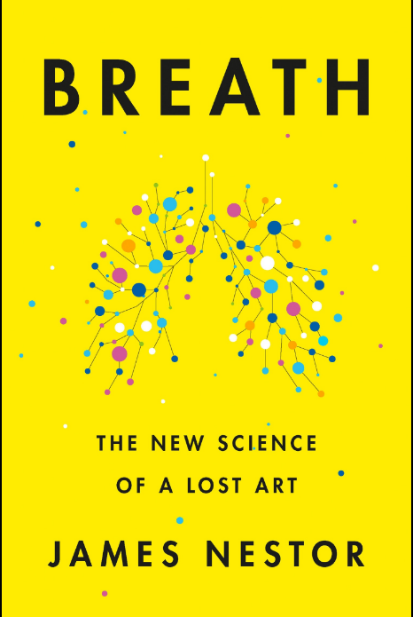

The new science of a lost art. This was yet another terrific read from James Nestor! In 2014, His first book that I read - [Deep](https://srikanthperinkulam.com/book-review/deep-freediving/), opened my eyes to a sport and lifestyle that I had no clue existed. This book has coaxed me to appreciate breath a lot more. This is a must read for anyone remotely interested in fitness and health, or trying to recover from any ailment.

In several ways, James spreads out this huge canvas that touches on various breathing tools, weaves in and out of ideas probed by Scottt Carney in [The Wedge](https://srikanthperinkulam.com/book-review/the-wedge/)  and [What doesn't kill us](https://srikanthperinkulam.com/book-review/doesnt-kill-us/) and then delves deeper into research work done by 'pulmonauts' who've spent their lives exploring and revealing the secrets of this fascinating realm.

Personally this book has helped me connect quite a few fragmented  thoughts in my mind. During the [TARC camp in 2016](https://www.flickr.com/photos/srikanth_perinkulam/albums/72157669983500465), David Bidler introduced me to the mesmerizing power of carbon dioxide. In 2017, it coaxed me to explore Ashtanga. Over the next couple years I've consciously focused on nasal breath running and it's made a huge difference. After reading the book, I'm even more driven to apply the breathing methods he's mentioned in the Appendix.

Now James' usses a lot of anecdotal  references and most of the content is portrayed based on his self experimentation and in tandem with various practitioners. For those that are driven by numbers and deep statistical analysis in everything out there, this book might not satisfy their thirst. However, it opens up some interesting avenues to explore and what you could call bio-hack minor niggling health issues.
