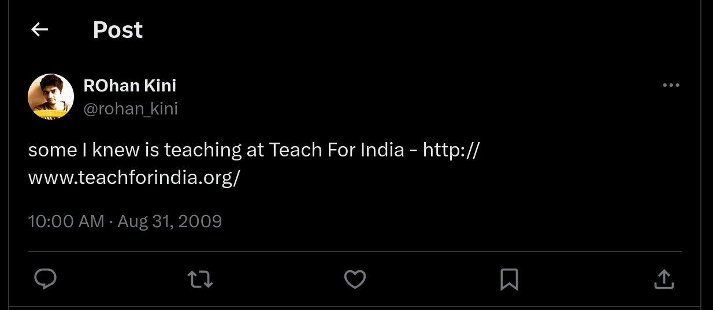

---
categories:
- Milestones
date: "2010-01-21"
tags:
- teach-for-india
- teach-for-india-hyderabad
- teachforindia
title: Gut Instinct, Twitter and My Career
---

I've always wanted to wake up in the morning and find the day ahead unpredictable. I wanted to think on my toes and look for a challenging day ahead that would need me to take decisions on the fly. I wanted to have a slice of 'adventure' every day in my life. Over time I realised its more promising to trust your gut instinct than anything else. I personally feel relying on 'gut instinct' is not just doing things impulsively but It's more about taking decisions on the fly which inherently is strengthened over time based on your past experiences through a subconscious thought process.

A year and a half back I signed off my '[one year in IT](../2008/07/the-it-mirage/)' post with this statement- '_Probably I’ll be doing something starkly different next year or for all you know still be eluded by the mirage of recognition all the way lamenting ‘C’est la Vie ‘ and keep moving_.' Little did I realise what was concocting. I should have seen this coming way back then. Three months from now I'll be making a paradigm shift in my career and what else do I attribute this to but for [one of Rohan Kini's tweet!](http://twitter.com/rohan_kini/status/3665859697)

<!--more-->I guess its time I unofficially announce \[For records!\] my decision to move out of  the role of a Software engineer and walk into the role of a teacher.  I was intimated on my selection for this fellowship on Nov 30th itself  but I guess it took me another two months to digest the fact. I'll be joining a team of 150 fellows selected from various professions all across the country to mentor kids in low income schools. For two whole years, as a fellow of [Teach for India](http://www.teachforindia.org/), I would be working with the kids, their communities and their familes to help improve the literacy numbers. The very thought that I would be responsible in moulding the lifes of about fifty kids over a span of two years sends a chill down my spine.

It's been an excruciating three whole months process and I still remember checking my mail every half an hour on my mobile on Nov 30th awaiting the confirmation response from the team. \[I probably wasn't this anxious even during my Infosys interview!\] I applied for the fellowship right the next day I got to hear about the program through Rohans' tweet. Initially I assumed this would be a cakewalk. But after a couple of days the structured process that was in place to take in the second set of fellows became evident. SOPs, Recommendation letters, Telephonic interviews and a day long in-person interview  - Boy, I really wasn't prepared for all this! I in fact didn't even inform my family members till the day of the Assessment interview!

Post my selection, life's been a bit different. People kind of do not look at me the same way. All optimistic views aside, moving out of a stable job to unknown realms is at times unnerving. I've been receiving mixed responses from my colleagues and friends when they get to hear about my decision. It at times bothers when you hear your colleagues earning a higher pay as they switch jobs. To be frank, in the initial few days I was even thinking of scrapping all plans and banking on the safe job that I had. But as I got to speak to the current fellows and the program co-ordinators things really got better. A much deeper analysis and ground work put things on the brighter perspective. Besides this decision also had direct implication on what I wanted to do ever since I started teaching at the Arundati upper primary school. That one day changed the way I looked at things. Just two hours and I was already emphasizing on the need for a much regular workable model to help the kids improve and I guess this is where my gut instinct played a vital role. If I was not interested in the program I simply wouldn't have applied for the fellowship impromptu. With that single ideology I sent in my confirmation on Dec '07th despite having time till Jan 03rd.

The next two years is probably going to be the best learning experience I could ask for. I would need to work on issues I've never thought of  and look at things from a grass root level perspective. I would need to think twice before I spend every pie from my pocket and learn to un-learn some things that 'corporate life' has taught me. I would need to think out of the box and bring about innovative ideas to help improve the current scenario. To be frank, I still do not have a clear cut picture as to what I should/would be doing post this fellowship. Guess I'll take it in stride and figure out things as they roll out.

Earlier this month, I came across this talk by the CEO of Teach For India - Shaheen Mistry at the TEDxASB event. You seriously need to watch this to see what this is all about. Nothing short of a three stomped salute.

<

p style="text-align:justify">

India as a developing nation needs institutions such as this to help bring about change. Change in the way we respond to the seething demons that are deep rooted in our day to day lives. Unless Illiteracy, Poverty and Corruption are brought under control, there's remote chance that we as a Nation stand to a glorious future. Philanthropy or Altruism come nowhere in the picture. All that is required is human force that believes in setting things straight.
