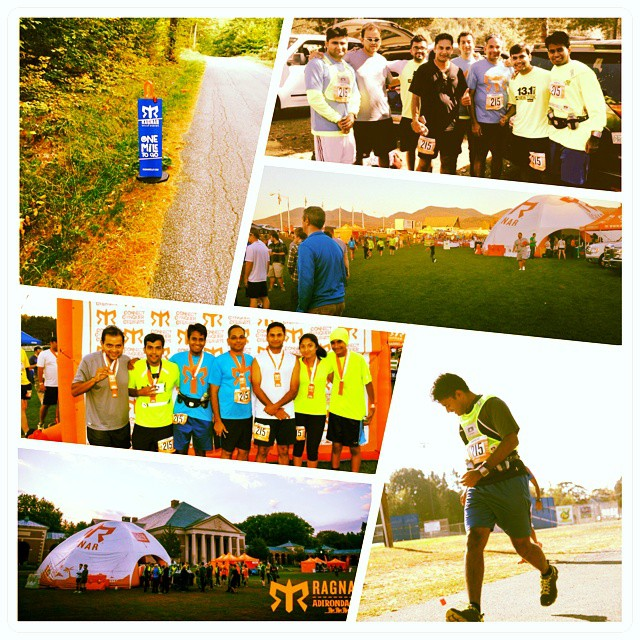

---
categories:
- Travel
- Running
coverImage: Ragnar.jpg
date: "2014-10-08"
tags:
- adirondacks
- appalachians
- ragnar-relay
- running
title: Appalachians next!
---

Couldn't have ended September on a better note! Pounding the hilly terrain in the Adirondacks for 36 hrs, straight through the night with 9 other folks - This has been my best run so far. Though technically that's a lot of time for 197 miles, I guess it's the nuances of the event that really gives you the extra kick.

<!--more-->

Running on those hills for miles at night with just absolute darkness for company, the sudden sprint from a water-station when you realized it was tactfully positioned right in front of a cemetery, the thrill of handing over the slap band to the next runner at the end of your run, the last one mile which never felt so close and that particular runner who always seems to cross you on every single uphill - few things that is quite uncommon in other running events. To top all of that, the camaraderie that emerges from participating in an event of such a scale just cannot be replicated in any other event.

Looks like I'm more than 'addicted' to these Ragnar events and can't wait to start training for yet another run. My feet yearn for a good trail run and how wonderful it would be if I could blend that in with a Ragnar event. **[Appalachians next!](http://www.ragnartrail.com/locations/appalachians-wv)**  Will probably fit in a couple of half's in between just to keep the muscles working.
