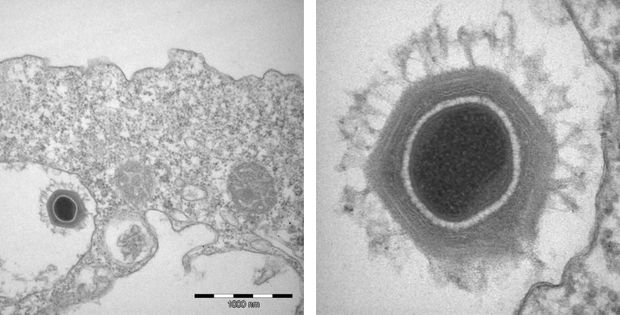

---
categories:
- Micro
- Listen
coverImage: virus.jpg
date: "2016-04-02"
tags:
- chatter
- podcasts
title: Shrink - Radiolab
---

> 
> 
> The definition of life is in flux, complexity is overrated, and humans are shrinking.

Source: _[Shrink - Radiolab](http://www.radiolab.org/story/shrink/)_
