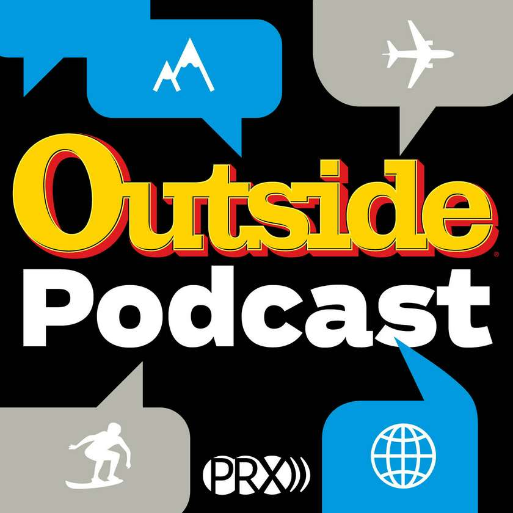

---
categories:
- Listen
coverImage: s990993bc73671c57043f82d66796651abc001f1447ebbc243ad8fb0ea7863feeampw840ampuhttps3A2F2Fcdn-outside.prx_.org2Fwp-content2Fuploads2Fpowerpress2FOutside_podcast_logo.jpg
date: "2017-02-07"
title: Frozen Alive — Outside Podcast
---

> 
> 
> The cold hard facts of freezing to death.

Source: _[Science of Survival Ep01: Frozen Alive — Outside Podcast — Overcast](https://www.outsideonline.com/2060546/ep01-frozen-alive)_
