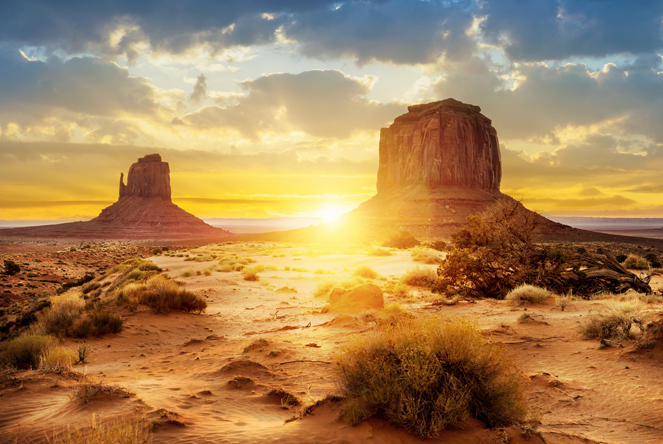

---
categories:
- Micro
- Read
coverImage: iStock-173659157.jpg
date: "2017-04-24"
tags:
- chatter
title: Understanding Public Land Designation
---

> 
> 
> The US boasts some of the world’s most diverse and beautiful wild places. This is where you love to hike, climb, and camp. But how much do you know about it?

Source: _Understanding Public Land Designation_
