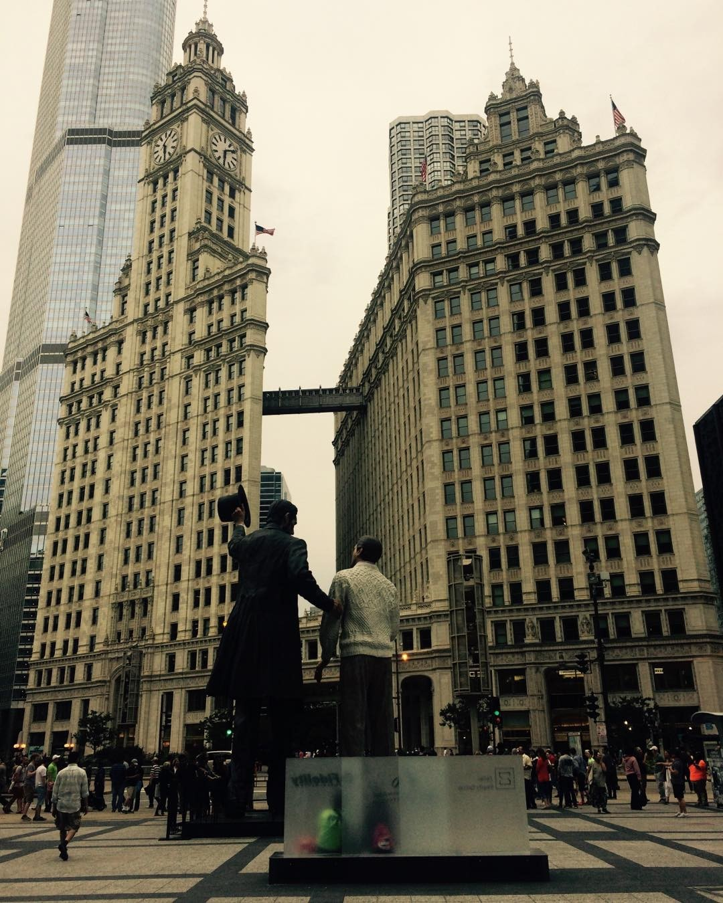

---
categories:
- Travel
- Photos
- Week-notes
coverImage: 1503969219.jpg
date: "2017-08-29"
tags:
- bananagrams
- chatter
- chicago-triathlon
- chiya-chai
- gettysburg
- hopewell-brewing-company
- lake-shore-trail
- return-visit
- seward-johnson
title: Return visit
---

Seward Johnson's - [Return visit](http://www.chicagotribune.com/g00/news/ct-abraham-lincoln-statue-pioneer-court-met-20161101-story.html)

A quick weekend trip to Chicago to meet Neeraj and Kanu. Took this opportunity to explore Chicago a bit.

Chicago downtown felt like an eclectic mix of Boston and NYC. Spent some time walking around the city on Saturday covering the regular spots leading up to Navy pier and back. Totally mesmerized by the greenish-blue waters of Lake Michigan! Headed over to Native foods cafe (finally!) for dinner. Elizabeth joins us and later we decide to head to Hopewell Brewing company. Grab some drinks and dive into some interesting board games with live music in the background. Played a slew of bananagram rounds and decide to head back to the hotel.

Plans to bike the Lake shore trail on Sunday fell through because of the Triathlon. Oh well! Decide to head up the Willis Tower. Not quite impressed. Head over to Chiya Chai for lunch. Absolutely blown over by the food! I'm sure we'll be back here during our next visit. Packed some food for the flight back to Boston and we're home by 9ish.

So glad we could make this trip. Some real good time catching up with Neeraj and Kanu after five long years. Time flies!

[Srikanth Perinkulam](https://srikanthperinkulam.com)
