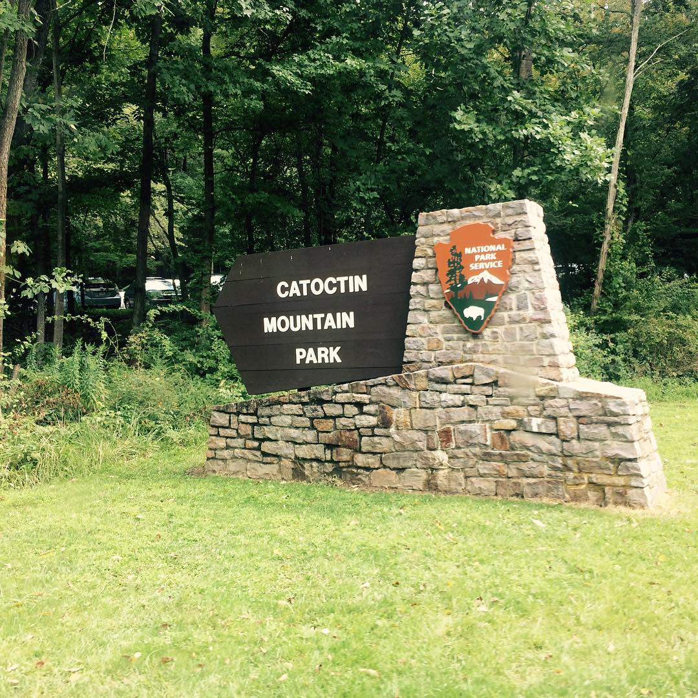

---
categories:
- Travel
- Photos
- Week-notes
coverImage: 1504664127.jpg
date: "2017-09-04"
tags:
- catoctin-mountain-state-park
- chatter
- cunningham-falls-state-park
- hikes
title: Cunningham falls
---

Nik turns 10 and we decided to spend the day outdoors. Head to Cunningham falls for a hike instead of Shenandoah. The falls by itself wasn't any impressive. Took less than 30 minutes to reach the tiny cascade standing all of probably 80ft. Was expecting Maryland's highest falls to be much higher than this!

Looped back to the parking lot on a slightly longer trail. Miss shey totally killed it! This 2 year old hiked the whole stretch with absolutely no complaints!

Rented a canoe because why not? Nancy fluttered in the front while Nik and I paddled the canoe for about 30 minutes. First time ever handling a canoe in a large water body. Felt eerily good! Should take to the waters more frequently...
