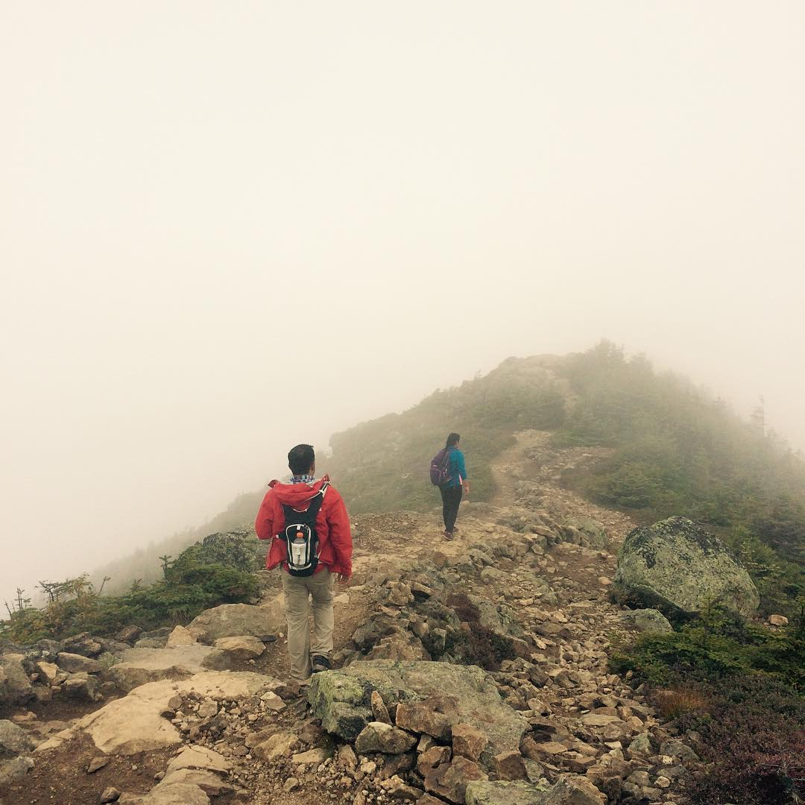

---
categories:
- Photos
coverImage: 1505038115.jpg
date: 2017-09-10
tags:
- boston-hikes
- chatter
- flags-on-the-48
- franconia-notch
- hiking
title: White-out on Franconia
---

Early on friday morning on the way to the T station, it suddenly struck us that we could actually hike overnight to catch sunrise on the ridge. With the full moon just starting to wane out, it was going to be a beautiful bright night. I was psyched, Miss Me was almost convinced, and now all that was left to alter the plan was to check with Keshav and Chaitra. A few hours later the weather report predicts thunderstorms and with that our overnight hike plans go kaput. We decide to stick with the original plan to head out of Boston at 0400 the next day morning. Chaitra decides to take a rain-check on the hike, so Miss Me and I head over to Keshav's place late that night.

We hit the road by 04:15 next day morning. With dense fog, most likely because of last nights' thunderstorm, the drive up to NH is starkly different from last time. Around 06:40 we start on the Falling waters trail. I anticipate reaching the first switch-back in around 45 minutes but I'm pleasantly surprised that we come across it in just about 20 minutes. As we slowly trudge up the falls and across the streams, Meena and I are reminded of the time we spent here in July; pitch darkness with just two headlamps trying to find the path back to the start point. It's incredible how the mind's able to connect situations so lucidly... We soon cross the horse's tail waterfalls and from here, as expected, the trail gains elevation pretty quickly. At about 10:00 we reach little haystack.

The ridge looked so fierce, yet so welcoming. Dense fog considerably reduces the vision and we could barely see a few feet ahead. The intermittent heavy wind gusts made the ridge walk even more enticing. As we phase in and out of the clouds, an elderly couple tag along. Some fun exchanges and they recommend we hike Mt. Carrigain and the Owl's head. Taking a mental note we head on towards Mt. Lincoln and then Mt. Lafayette.

This time around the climb up Mt. Lafayette felt much shorter. I don't quite remember it being this easy while scaling down the peak last time we were here. Must be the weather! Just as we're summiting the peak, a lady and her son mention that a group was hoisting the flag up on Lafayette. We're just in time! Up on the peak we learn apparently it's a [tradition now](http://www.flagsonthe48.org/) and a flag is hoisted on all 48 4000 footers in New Hamsphire on the weekend close to September 11th. We're lucky we got to be up here just around the right time!

Pretty soon we decide to head down the peak to the AMC Greenleaf hut. Devour some ridiculously tasty hot soup and make our way down the Old briddle path to the parking lot by 1530.

Having done this loop from both directions, I feel the OBT->FWT direction was definitely more challenging. Today's hike however was a totally different experience when compared to the [one we did in July](https://srikanthperinkulam.com/2017/07/25/franconia-ridge-hike/). Was it the weather, Was it just our pace? Or was it just the whites? The lure of these mountains is just so irresistible!
