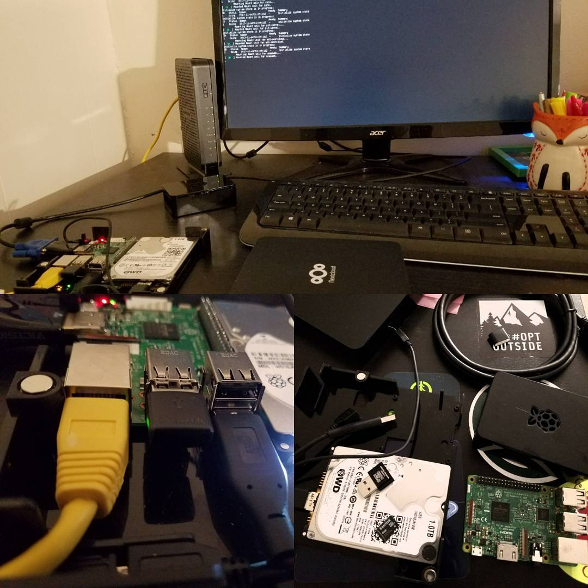

---
categories:
- Photos
- Tech
coverImage: 1509819219.jpg
date: "2017-11-04"
tags:
- chatter
- indieweb
- nextcloud-box
- raspberry-pi3
title: Fired up!
---

Finally got around procuring a [pi3](https://www.raspberrypi.org/products/raspberry-pi-3-model-b/) and setup the [Nextcloud Box](https://nextcloud.com/box)! Getting this up and running was super fun and pretty straight forward.

The OS Image that was delivered with the box was built for the pi2. So I had to format the drive with Gparted and flashed the pi3 image with [Etcher](https://etcher.io/) (One nifty piece of software!). Once the hardware was fired up, it just took care of itself. The web install was a 1-click setup.

Early this year as I initiated taking more control over my data, I also setup a [Nextcloud server on the cloud](https://meandsri.ddns.net). It's been about eight months now and am thoroughly impressed with it. With the incredible iOS and android apps and the nifty client for linux I'm more than convinced the take this a step further and setup my personal home server.

Over the next few weeks as I tinker more with this, I need to make this a more robust setup and make full use of the snappy Ubuntu core.

[Srikanth Perinkulam](https://srikanthperinkulam.com)

[Srikanth Perinkulam](https://srikanthperinkulam.com)

[like](https://twitter.com/intent/favorite?tweet_id=926942668512428032) [reply](https://twitter.com/intent/tweet?tweet_id=926942668512428032) [repost](https://twitter.com/intent/retweet?tweet_id=926942668512428032)

[like](https://twitter.com/intent/favorite?tweet_id=926942668512428032) [reply](https://twitter.com/intent/tweet?tweet_id=926942668512428032) [repost](https://twitter.com/intent/retweet?tweet_id=926942668512428032)
