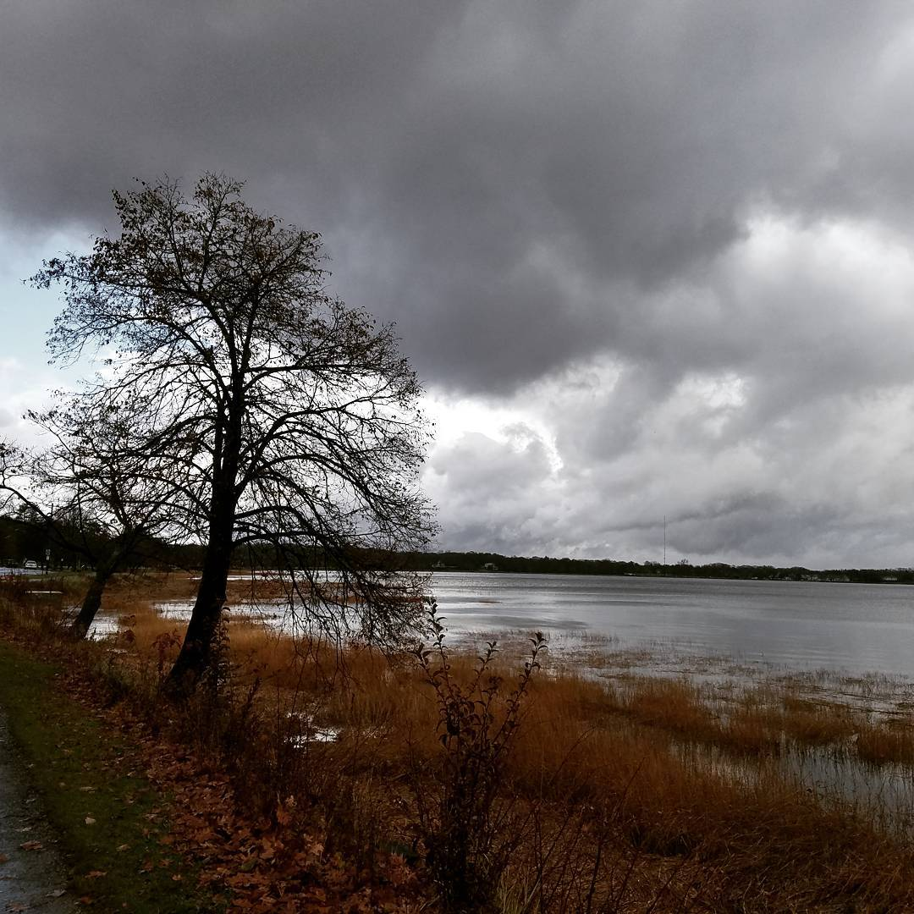

---
categories:
- Photos
coverImage: 1511134705.jpg
date: "2017-11-19"
tags:
- chatter
- run
title: Howling winds
---

Grey sky, howling winds and low 40s. Perfect weather for a good long run by the agitated waters. David [organized a fun run and food drive](https://www.facebook.com/events/150580065675902/) for the Pebble street food pantry. Decided to head to the 0730 Ashtanga led class since we'd missed most of last week and then head to Portland later after breakfast. Was a bit of a drive from Boston but was absolutely worth it.

 

There's something just so mystical about these waters

[Srikanth Perinkulam](https://srikanthperinkulam.com)
