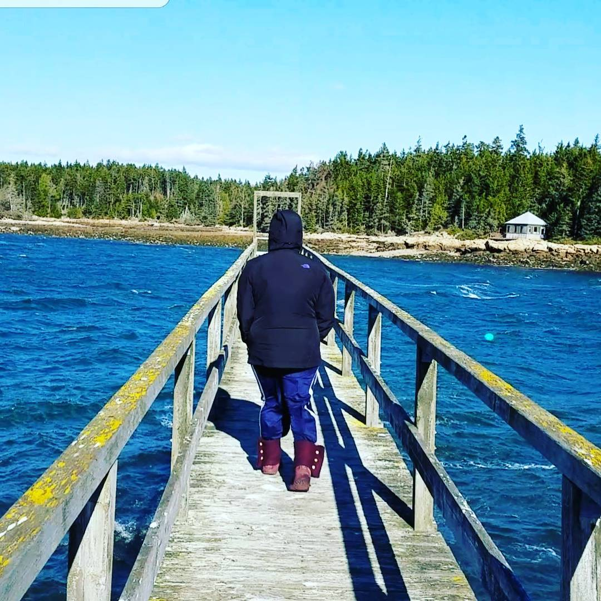

---
categories:
- Photos
coverImage: 1510790838.jpg
date: "2017-11-15"
tags:
- acadia-national-park
- chatter
- frazer-point
- schoodic-peninsula
title: Labrador cold front
---

Mystical blue waters allured us to this spot as we were driving into the peninsula. Terrific gusts of freezing wind literally consuming us in whole. We were struggling to hold our footing. The ranger mentioned what we were witnessing was a labrador cold front from Canada and this was supposed to subside by the evening. Beyond doubt the strongest gale forces I've ever experienced so far.

We were so close to NOT coming over to the peninsula. So glad we decided otherwise!

Those few moments experiencing nature in its raw form will remain etched in memory for a long time now. Chance encounters!

 

 

 

[Srikanth Perinkulam](https://srikanthperinkulam.com)
