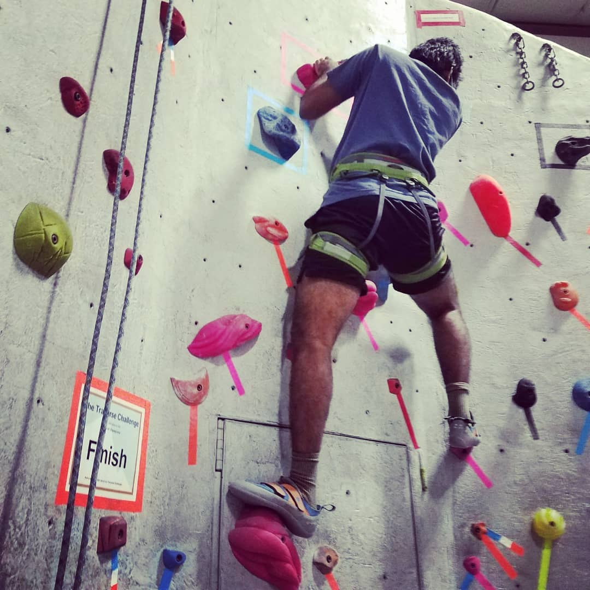

---
categories:
- Activities
- Photos
coverImage: 1513812908.jpg
date: "2017-12-12"
tags:
- chatter
- rock-climbing
title: 32 and onwards!
---

Miss Me gifted me a months rock climbing pass for my birthday. Been at it for a few weeks now and we're thoroughly loving it! Something that we've been wanting to do for a while now and I'm psyched we got to start it on my birthday.

We try and make it to the gym almost every day. After a long day at work it's amazing how just entering that space helps clear your mind altogether! An hour in and though you're physically tired, you walk out with so much more energy. Goes without saying, it also aligns  with one of my resolutions this year to work on my upper body strength.

Last birthday, we went for an [indoor diving class](https://srikanthperinkulam.com/2016/12/12/flying-31-with-the-reindeer/), six months later we [started ashtanga](https://srikanthperinkulam.com/2017/06/12/ashtanga/) and now this! Loving the trend!