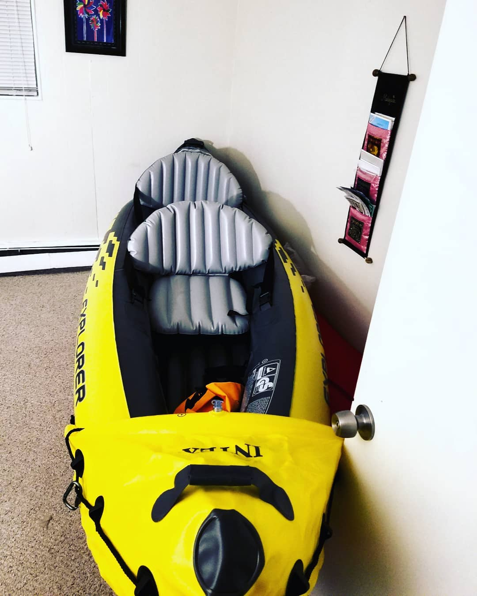

---
categories:
- Photos
coverImage: 1514858915.jpg
date: "2018-01-01"
tags:
- chatter
- gifts
- kayak
title: Row, row, row your boat...
---

Can't wait to get this into the water! Ever since our [poconos rafting trip](https://srikanthperinkulam.com/2017/07/11/rafting-at-poconos/) in July last year I've had my eyes on getting a kayak for myself. One of my relatives thoroughly surprised me with this as a birthday gift last December. Later when we met, he mentioned that he swapped the single carrier kayak that he bought initially, for this dual person version to make sure the Mrs. gets me back safe on shore If I decide to go astray in my often impromptu escapades. A bit unsure how I should read that statement, However I'm absolutely floored and immensely thankful!

With this latest procurement, I'm even more excited to attend the [2018 AMC Annual summit](https://www.outdoors.org/AnnualSummit) that Miss Me signed me up for last weekend. The intro to sea kayaking seemed particularly interesting!

I was more than excited to inflate the kayak yesterday on the last day of the vacation. Currently temperature has breached the negative Fahrenheit frontiers (Surprising for this time of the year!) and It'll be time before it actually hits the waters but I've decided to leave it inflated indoors as a fun reminder to get outdoors more frequently. 2018 summer looks to be even more promising!

Happy New Year!

[Srikanth Perinkulam](https://srikanthperinkulam.com)
