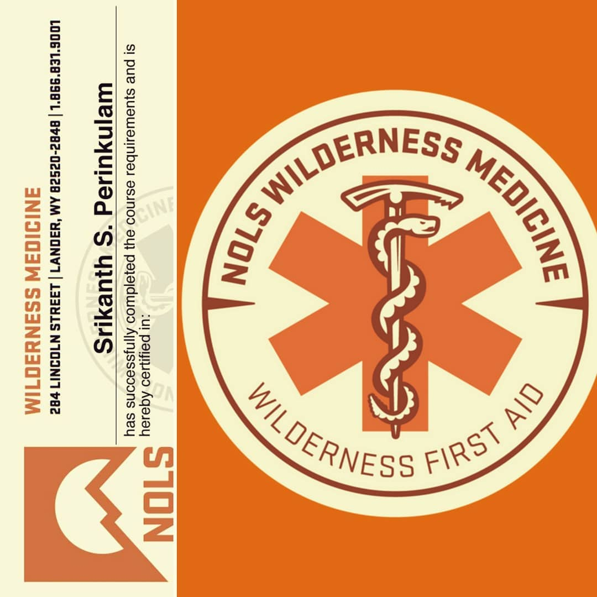

---
categories:
- Travel
- Milestones
- Photos
coverImage: 1519769065.jpg
date: "2018-02-27"
tags:
- chatter
- nols
- wfa
- wilderness-first-aid
title: WFA Certified
---

Over the last 12 or so years that I've been hiking now, I've learnt a ton from my goof-ups. I believe in taking calculated risks and am reasonably okay with 'winging' a hike as long as I have the right gear and know what the game-plan is. Still, every hike that I've been on and the deeper I've been into the wilderness, I've always pondered what would happen if either me or someone in the group needed medical attention.

Last year, I joined the REI co-op and the Appalachian Mountain Club (AMC) and through them heard about a slew of courses one could take part in to be better prepared while out there in the wilderness. The first-aid course did get my attention. One of those things that I've been wanting to do for quite sometime now but never got around taking the time and effort to work on.

Well, not anymore! Early this month I attended a wilderness first-aid (WFA) certification course organized by NOLS. It was a short yet extremely insightful course on responding to different situations one might encounter while deep in the wilderness. The course was more aligned to situational leadership and had several elements on training your mind to work on a methodical and well thought through set of actions \[The SOAP (Subjective, Objective, Assessment and Plan) approach apparently pretty commonly used in the medical field\]. We were also introduced to regular first-aid skills for patient care and some basic wilderness survival do's and dont's.

With day long sessions and several practical scenario try-outs this was one long rewarding weekend. I'll need to make sure I practice those skills intermittently just so I don't forget them. To delve deeper, I'll possibly sign up for the Wilderness First Responder (WFR) course sometime later this year. Winter is almost on its way out and I eagerly look forward to spring and summer to get some good long hikes in this year!

[Srikanth Perinkulam](https://srikanthperinkulam.com)
