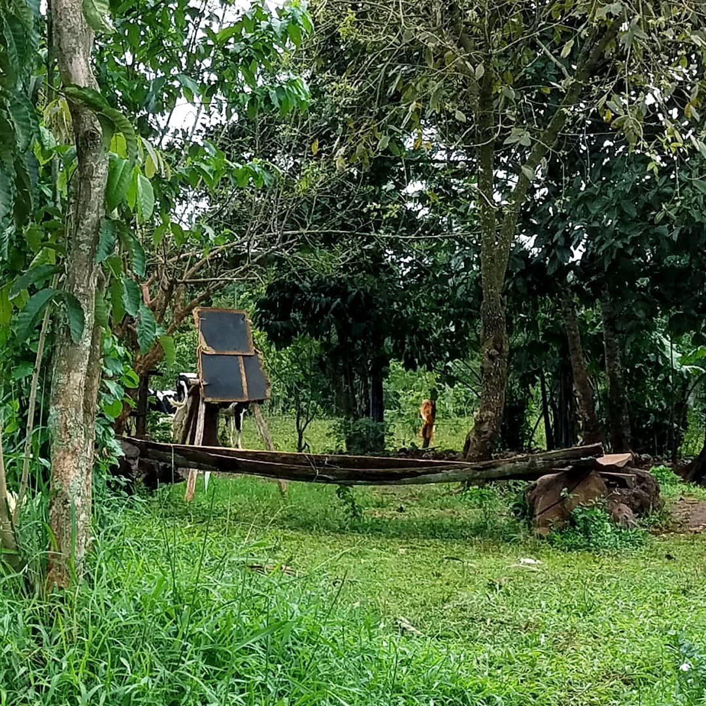

---
categories:
- Travel
- Photos
coverImage: 1521493439.jpg
date: "2018-03-19"
tags:
- airborne
- chatter
- lugazi
- mabira-forest
- musamya
- rainforest
- scoul
- uganda
- ziplining
title: The sky captain's school
---

As we enter Lugazi on route A109 towards Jinja, Google Maps suggests we take an unpaved dirt road on the left. The red slushy path meanders through small shops and houses and an eerie sense of awareness creeps in as villagers notice the Toyota Rav4 rolling into their 'area'. I read last night that the 10km stretch to the Griffin falls camp area would be dirt roads winding through sugar-cane plantations. Last night's rain and the incessant drizzle seem to have worsened the roads. Thankfully, the Rav4 handled the conditions insanely well.

A few kilometers in, direction signs to the camp lead us to the camp site. Looks like we're the only two folks who'd be zip-lining today. Setup by [Aaron Blanchard](https://aaronblancharduganda.blogspot.ug/) a US Peace Corps volunteer [in 2014](https://aaronblancharduganda.blogspot.ug/2014/02/), the [Mabira forest canopy super skyway](http://www.mabiraforestcamp.com/super-skyway.php) is a phenomenal way to explore one of Central Uganda's rainforests. After a short 15 minute walk in the woods from the campsite, the 'Sky Captains' guide you up a ~40 ft tree from where you zip-line across the forest on five zips with the last one being a controlled repel between two 115 foot trees across the river Musamya. I've zip-lined a few times before, but never in a forest this high. Richard and Gerald - Our Sky captains did a terrific job showing us around and securely navigating us on the trees. Once off the zip system, Gerald led us to Griffin falls and then back to the campsite.

\[embed\]https://vimeo.com/260921681\[/embed\]

River Musamya is heavily polluted by the Sugar factories upstream. Mabira forest by itself is on the cusp of heavy deforestation. The Sugar Corporation of Uganda Limited (SCOUL) - Jointly owned by the Government of Uganda and The Mehta Group apparently planned to clear one-third of the forest area to create sugarcane plantations in 2007. With resistance from local non-profits and environment groups the government is seemingly caving in. Very recently, it [announced to buy-out the mabira forest residents](http://www.monitor.co.ug/News/National/Conservation-Government-buy-off-Mabira-forest-residents/688334-4348562-ctstx5/index.html). With all things environmental, politics and business we'd never really know where this balance is going to tilt.

On our way back, a guy from a village asked us to pull-over and checked if we could give him a ride to Lugazi. We were neutral but politely said we couldn't. One of those times where you never really know what's the right thing to do in a foreign place...Also, there apparently has been an underlying racial tension against Asians here since the Mehta group is an Indian firm and the Chinese too do seem to have a strong presence in the Sugar business.

On the drive back to Kampala, It struck me why I really like travelling or doing things outdoors. It's just not about the activity that you end up doing, It's the broader awareness that you get when you're exposed to the framework that has led to the creation of that event.

[Srikanth Perinkulam](https://srikanthperinkulam.com)

[like](https://twitter.com/intent/favorite?tweet_id=976064261997907968) [reply](https://twitter.com/intent/tweet?tweet_id=976064261997907968) [repost](https://twitter.com/intent/retweet?tweet_id=976064261997907968)
