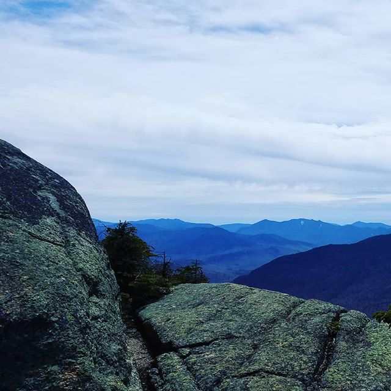

---
categories:
- Travel
- Photos
coverImage: 1526868194.jpg
date: "2018-05-13"
tags:
- chatter
- hiking
- mt-garfield
- nh-48-4000-footers
title: Mount Garfield Hike
---

Photo taken at: Mount Garfield

First hike with the AMC. Four hours climb up to the summit with icy conditions in the last 1000ft. Microspikes saved the day! Under tree line pretty much all the way till the end. The peak does open up to a 360 degree view. Could spot quite a few other 4000 footers from the top. Franconia Ridge looked pretty tiny from here! A quick 2.5 hour hike got us back to the trailhead. Good pace, good work-out and first 'technical' winter/early spring hike!
