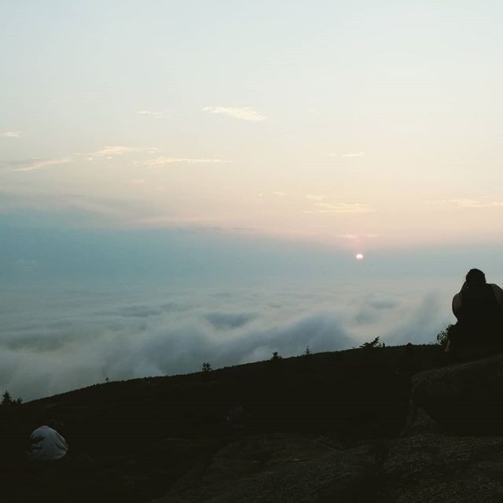

---
categories:
- Travel
- Photos
- Week-notes
coverImage: 1530754763.jpg
date: "2018-07-04"
tags:
- acadia-national-park
- chatter
title: Acadia
---

Photo taken at: Cadillac Mountain, Acadia National Park

Last November we drove to Acadia and had a [terrific experience](https://srikanthperinkulam.com/2017/11/15/labrador-cold-front/) there with the Labrador cold front.Being off-season, there was sparsely any crowd and we had most of the park just for ourselves.  Those three days were the most relaxed days we spent together in a while.

Earlier this month, we revisited Acadia, this time with family. The park was very crowded and we had to rise up pretty early to have access to some quiet zones. Nevertheless, it was a just great being back there. Drove around the park loop, hiked up the bubbles, and visited Schoodic peninsula and Bar Island. Stayed at an RV camp park in Ellsworth.

Nothing to beat some good quality time with family, outdoors!
