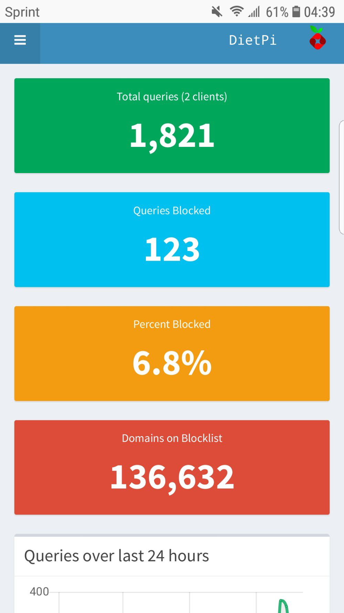

---
categories:
- Tech
- Tech
- Tech
coverImage: 1546508775615.jpg
date: "2019-01-03"
tags:
- chatter
- diet-pi
- odroid-xu4
- pi-hole
title: ODroid XU4 SBC
---

Meena and my family gifted me an Odroid XU4 SBC earlier last month as a Christmas/B-day gift. One of my projects during the year-end holidays was to setup a robust home server; Essentially getting my webservers home from Digital Ocean, where they are currently hosted. This would be a terrific companion to the [nextcloud fileserver](https://srikanthperinkulam.com/2017/11/04/fired-up/) that I setup earlier using a raspberry pi.

Earlier this week, I chanced upon [DietPi](https://dietpi.com/) and decided to launch it on the eMMC chip. One of the first things I did was to install [Pi-Hole](https://pi-hole.net/). With uBlock addons' that should be some good riddance to ads across my home network! Would be interesting to keep track of these network pings to see what devices are needlessly calling 'home'.

I've ported my web applications to the Odroid board and am currently testing out the server internally before I 'turn on' the traffic switch. All looks super-promising so far! Over the next few months, I'll have to tweak the settings and tune this mini-beast a bit for performance. For now though, I'm more than happy with what it's delivering!
