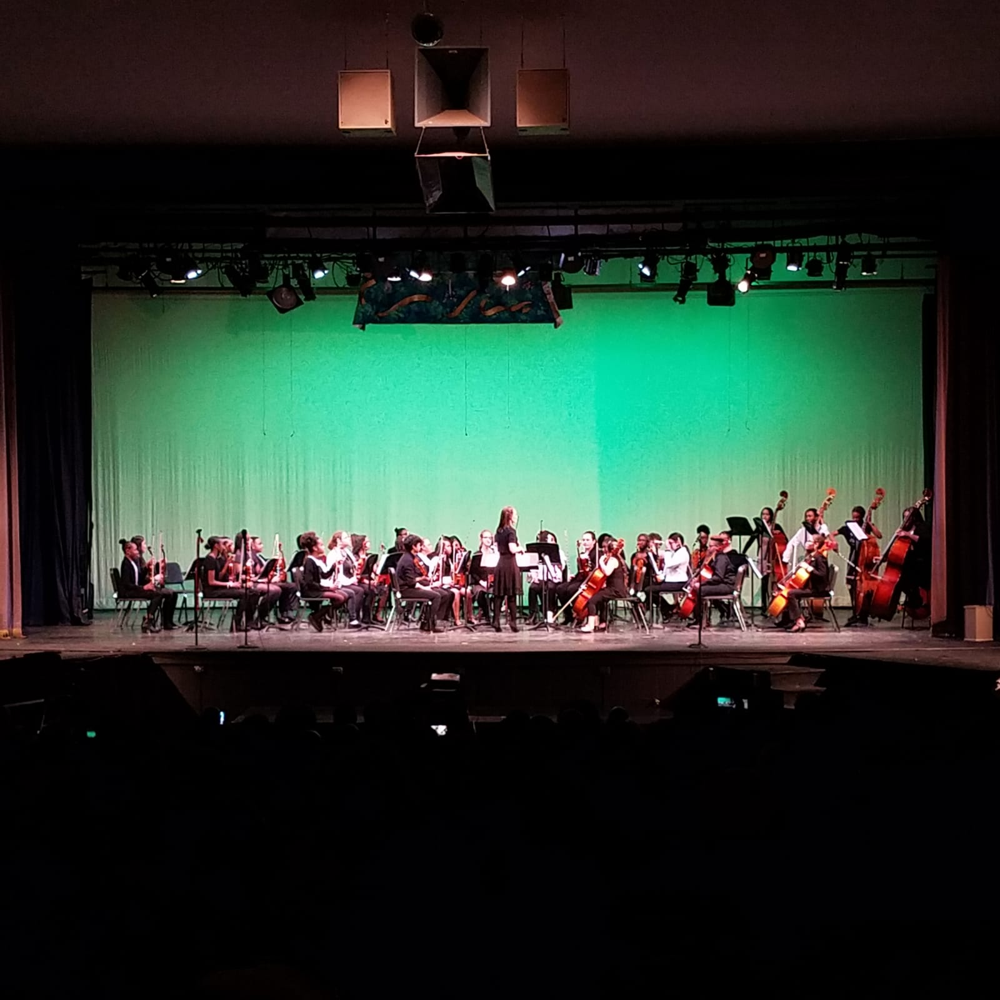

---
categories:
- Week-notes
coverImage: IMG-20191219-WA0021.jpg
date: "2019-12-22"
title: Weeknote 51 - Clouds down south
---

_A glimpse of the past week and the few articles, podcasts, tools, videos and music that captivated my attention:_

Got a RaspberryPi 4 kit for my eldest brother. Can't wait to set up a homeserver for him. On my nudging, the second eldest, setup a homeserver sometime back and we're very impressed with the speed and crisp loading of the photos he's currently hosting on a nextcloud setup. On a similar vein, I'm testing the cloud provider Hertzner. They're super cheap and seem to be pretty good. Will probably port over my services from Digital Ocean over the next few months if I find them stable.

Was wonderful to see Nik perform in his year-end winter performance. The group sounded way professional! Also, Nancy had her track meet yesterday. She's improved her pace a lot over the last year and it's wonderful seeing her truly enjoy running.

We decided to have an early christmas gift exchange with the Baltimore family before we hit the road for Florida. Initial plan was to leave early on Saturday morning and reach Miss Bama's home by the evening. As luck would have it, we noticed last night that we had to change the catalytic converter in the Sienna. Got that fixed first thing today at Firestone. Will now head down south, contingent on weather and traffic.

**Interesting reads this week:**

- [Ghost ships, crop circles, and soft gold: A GPS mystery in Shanghai](https://outline.com/cLEJea): GPS spoofing taken to a whole new level. It's insane how dependent we're on GPS these days and it's high-time we give this a deeper look!
- [A startup is pitching a mind-uploading service that is “100 percent fatal”](https://outline.com/4fTRT3): [Nectome's](https://nectome.com/) making quite some progress in 'preserving' human brains, and consequently 'memories' to be deciphered at a later point in time when we have the technology to do so!
- [Opinion | Twelve Million Phones, One Dataset, Zero Privacy](https://www.nytimes.com/interactive/2019/12/19/opinion/location-tracking-cell-phone.html): NYT's sniffing around with just one leaked dataset has some real interesting results. Nothing quite surprising but definitely a worthwhile read to remind one how key safeguarding one's location is!
- [What does your car know about you?](https://www.washingtonpost.com/technology/2019/12/17/what-does-your-car-know-about-you-we-hacked-chevy-find-out/): A 'connected-car' apparently is capable of generating 25 Gigabytes of data in an hour! The next few decades are going to be way uncomfortable.
