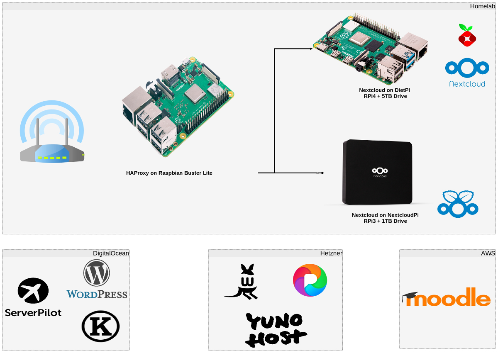

---
categories:
- Tech
- Tech
- Site
- Tech
coverImage: State-of-the-Network-Jan-2020-.jpg
date: "2020-02-04"
month: 2020-04
tags:
- homelab
- pixelfed
- sotn
title: State of The Networks - Jan 2020
year: 2020
---

_A quick rundown on the state of the home-servers I run or applications I host on the cloud._

Last week I opened up my Nextcloud instance for external access. Now, since my brother's RPi4 was already exposed on the same network, I had to setup a reverse proxy on another RPi3 to access both simultaneously behind the router. Here's the current setup:

**Proxy server:** An RPi3 running on Raspbian Buster Lite with HAProxy installed to handle the reverse proxy. Here's the [gist of the code](https://gist.github.com/sriperinkulam/23fee95d454fe3a9ff18a0555734e3ab) that's handling all the heavy lifting. Since SSL is handled by the other servers themselves, all I needed was a quick pass-through handshake from HAProxy.

**Server 01:** An RPi3 running on NextcloudPi essentially serving Nextcloud for all my file needs. Data is simultaneously backed up on a couple machines within the network. Decided against a remote backup \[S3/Backblaze\] for now.

**Server 02:** An RPi4 running on Diet-Pi and serving Pi-Hole and a Nextcloud instance. I've turned off DHCP on the Orbi router and delegated that to the Pi-Hole. Both the Pi-Hole and the router have static IPs assigned to the SBCs and my trusty Dell machine based on their MAC address. I'm debating if I should move the Pi-Hole over to the Proxy Server...

Beyond the home-lab, I have a droplet with DigitalOcean serving this website and a few other portals I manage. ServerPilot runs in the background on that droplet taking care of all the critical needs. I do intend to shift this over to a home-lab once I get hold of my ODroid XU4 which is currently in the Uganda shipment several thousand miles away in Chennai!

Early this year, I also procured a Hetzner cloud instance to test its stability and see if I could move over certain portals to it. Should say I'm pretty impressed! Running on Debian Stretch and powered by Yunohost, I installed [PixelFed](https://pixel.srkn.org/sriperinkulam) and Wallabag. Installation has never been any easier! One drawback for sure is that the code-base may be a bit lagged as it gets deployed on Yunohost. Nevertheless, it's pure magic to see things getting installed with just a few clicks and not much back-end work.

And then, I manage a Moodle Bitnami instance running on an AWS instance. I intend to move it over to the Hetzner cloud over the next month or so.
