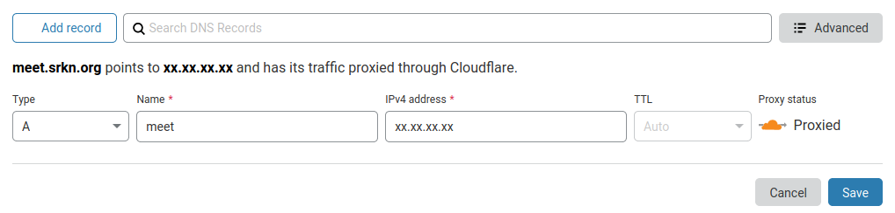

---
categories:
- Guides
- Tech
- Tech
- Site
- Tech
coverImage: image.png
date: "2020-04-19"
month: 2020-04
tags:
- alternative
- c7181e
- docker
- jitsi-electron-app
- jitsi-self-hosting
- traefik
- zoom
- zoom-alternative
title: Self-hosting Jitsi video conferencing
year: 2020
---

[Jit.si](https://jitsi.org/) is a terrific, secure video-conferencing #alternative to #Zoom and obviously comes with all the open-source awesomeness. Call clarity is amazing and with a room capacity of 100+ (and potentially much more, driven by network and server capabilities), it's an absolute no-brainer to switch over. Use [Jitsi Meet](https://meet.jit.si/) on the desktop or use one of their slick android, F-droid or iPhone apps on hand-held devices to organise your video conferences.

With the recent push to video-conferencing most meetings, I decided to setup my own instance. This was way more straightforward than I thought! I am currenty running it as a docker container, fronted with #Traefik for encryption. Configuration and installation steps mentioned below assume you have access to a domain name and server with docker already installed.

**Setting up the server:**

**A records:**

Create a new A record with your hosting provider to point your subdomain to the IP address of your server

**SSH into server and install**:

It should cost you only about 5$ per month for a decent server configuration. I already had an account with Hetzner, so I deployed my instance there.

SSH into your server: `sudo ssh user@xx.xx.xx.xx`

Initialise a swarm: `sudo docker swarm init`

Create the traefik network: `sudo docker network create --driver=overlay traefik-net`

Create two new yml files - one for traefik-ssl and another for jitsi, copy over the contents from the respective files [available here from ethibox](https://github.com/ethibox/stacks) and make edits as needed:

`sudo nano traefik-ssl.yml`

`sudo nano jitsi.yml`

Deploy the Traefik stack: `sudo docker stack deploy -c traefik-ssl.yml traefik`

Deploy the Jitsi stack: `DOMAIN=meet.srkn.org SCHEME=https docker stack deploy -c jitsi.yml jitsi`

If all goes well, you should now have a Jitsi instance running on your server with routing and ssl taken care of by Traefik.

**Configuring Jitsi:**

You now need to setup the admin account. Login to the Jitsi prosody container. (Update command to reflect your container name):

`docker exec -it jitsi_prosody_1.xxxxxx bash`

Set as many host credentials as you need:

`prosodyctl --config /config/prosody.cfg.lua register host meet.jitsi usejitsi`

Exit out of the console! You now have a fully functional self-hosted Video-conference running! Do note that the recording feature currently does not work outright. Will have to sort that out over the next few days.

**Desktop and Mobile clients:**

I decided to go the [electron route](https://github.com/jitsi/jitsi-meet-electron/#jitsi-meet-electron) for the desktop client. Jitsi has apps for both android and iOS that work out of the box. Just make sure you set the domains to yours.
