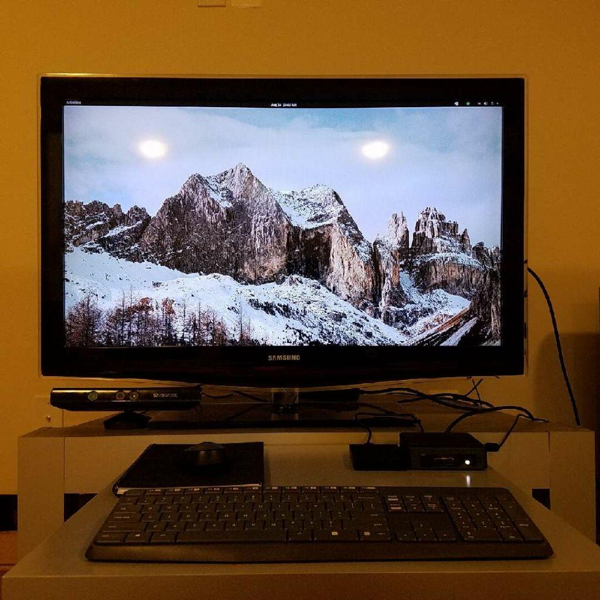

---
categories:
- Tech
- Tech
- Tech
coverImage: odfywNUIw08ldUgYLl3wgoarJq9gnPRPxRJ7JXbY.jpeg
date: "2020-08-21"
month: 2020-08
tags:
- intel-nuc
- popos
title: Mini yet mighty
year: 2020
---

I've had my eyes on the [Intel NUC](https://www.intel.com/content/www/us/en/products/boards-kits/nuc.html) for a while now. My current laptop has been on a downward spiral and a few days back, when I came across a fabulous deal on eBay for an unboxed but unused NUC, I took the dive and ordered it.

With 16GB RAM, 256GB NVMe SSD, 8TH Gen Core i7 Pro processor and Windows 10 Pro pre-installed - This is the most powerful machine I've owned. Agreed speed and performance is all relative. I'm just amazed that all of this fits in a tiny 4"x 4"x 1" box!

While at it, I also decided to switch over from [ElementaryOS](https://elementary.io/) to [PopOS](https://pop.system76.com/). The PopOS install was a breeze. After a quick drive-partition all it took was probably a couple minutes to install the OS! Super impressed with the UI and the tiling feature on large screens is crisp!
