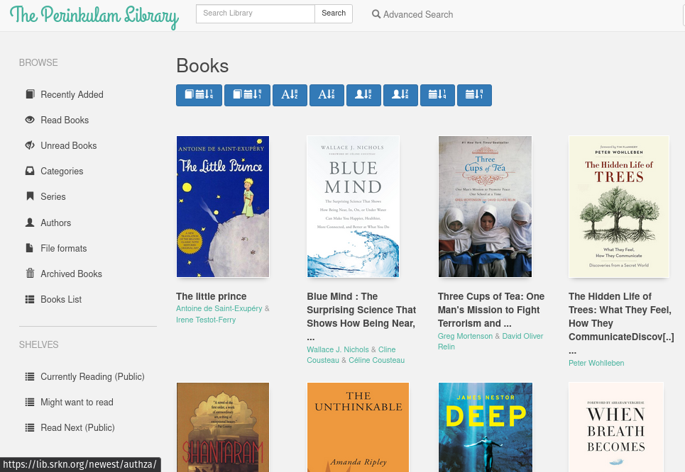

---
categories:
- Books
coverImage: Screenshot-from-2020-12-21-04-47-49.png
date: "2020-12-20"
month: 2020-12
title: The Perinkulam Library
year: 2020
---

I chanced on [Calibre-Web](https://github.com/janeczku/calibre-web) last week and finally got around better organizing my book collection. I really like the way it's turned out and if anything, this has been a silent nudge to read more and read frequently! The beauty of this is that, I can now share my collection with friends and family just like yesteryear's - when you would just borrow a book from a friend, read it and return it.

The collection is now available here - [The Perinkulam Library](https://lib.srkn.org/). If there's a book that you find interesting, let me know and I'll be happy to setup a guest account for you to read!
