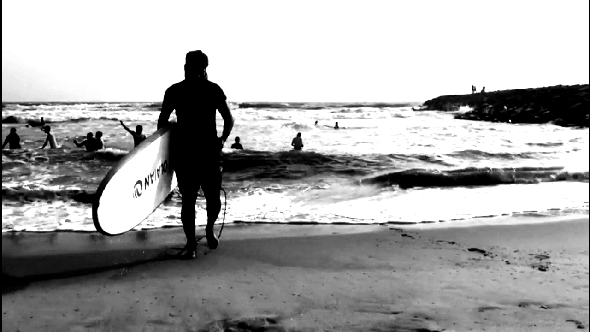

---
categories:
- Surfing
- Year-notes
cover:
  Image: images/20210102_040253-scaled.jpg
  relative: false
date: "2021-01-01"
title: Covelong riders
---

After a [muted attempt last year](https://srikanthperinkulam.com/2020/12/28/sea-la-vie/), we were able to ring in 2021 with an early morning Surfing class at Covelong. The girls loved it and I couldn't have asked for a better start. Exhilarating, to say the least. And oh, salt water does BURN your eyes!

Shasta enjoyed her time on the beach with her grand-parents. Dainty princess that she is, she apparently had her shoes on - for the whole two hours. Nevertheless she did enjoy the early breezy morning, watching us fall umpteen number of times. When asked later, she did mention she thought we were exercising. We'll go with that!

2020 was obviously a rough year for many. I'm extremely fortunate and thankful that C-19 had minimal impact on us and our extended family. Hoping that this 'new' year brings in closure on many fronts and at the very least gives us resilience to rebound stronger. Here's to riding those waves and taking time to connect with others during those lulls. Happy 2021!

