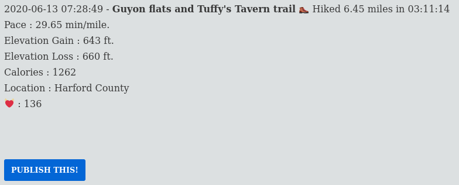

---
categories:
- Tech
- Tech
- Site
coverImage: image.png
date: "2021-05-29"
tags:
- garmin-connect
title: Owning my Garmin data
---

Over the last month, I took some time to build a tiny WordPress plugin that fetches data from my Garmin Connect platform and displays it on my website. Currently the workflow only pulls activity data from the platform - which was my focus for this month. With modifications to the python script, I think this can be extended further to fetch any type of data from the platform. Here's a rundown of the publishing workflow so far:

- Bluetooth Sync data from the watch to the Garmin connect portal. This is manual since I see no point in having Bluetooth turned on 24/7
- Edit the activity in the Garmin connect app for say activity title, activity type or just add some more context to the workout
- A cron job runs on my website twice every week to trigger [this python script](https://github.com/johannesh83/garmin-connect-export) in my WordPress plugin. I made slight modifications to the script so as to tie-in with my workflow.
- The python script connects to my Garmin connect account, pulls the latest three activities and saves them as JSON files on my server.
- The [garmin-stats page](https://srikanthperinkulam.com/garmin-stats/) when requested by a client, parses the JSON file for each activity and displays the content in a predefined format. There's also a provision to publish a specific activity as an individual post. If I'm logged in WordPress, a 'Publish this' button is displayed for activities that have not been posted yet.

- Currently I am assigning all of these posts to the 'workout' category and I've disabled these from showing up on my main RSS feed. These posts however do show up on my [micro-posts](https://srikanthperinkulam.com/micro/) page.

**To-do's:**

- The script currently triggers a 'Garmin login alert' email for my account. Most likely because of locale settings. Would be good to mute these.
- The plugin code currently dynamically generates the summary page on 200+ JSON files. I'll probably limit this to just 20 or so.
- Fetch non activity data too.
- Maps, charts, visualizations!
- Always scope for cosmetic tweaks!

**Micro updates:**

- [**May 7, 2021 14:31**](https://srikanthperinkulam.com/2021/05/08/may-7-2021-1431/)
- [**May 11, 2021 19:19**](https://srikanthperinkulam.com/2021/05/12/garmin-plugin/)
