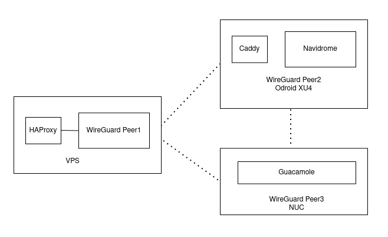

---
categories:
- Guides
- Tech
- Tech
coverImage: image-2.png
date: "2021-07-28"
tags:
- apache-guacamole
- caddy
- docker
- navidrome
- odroid-xu4
- wireguard
title: Caddy through the tunnel
---

_Leave a comment if any of this doesn't make sense. I'll be more than happy to help._

I recently installed [Navidrome on an Odroid XU4](https://srikanthperinkulam.com/2021/07/28/july-27-2021-2105/) and configured [Guacamole on my NUC](https://srikanthperinkulam.com/2021/07/15/guacamole-clientless-remote-desktop-access/). To access these applications securely on an external network, I setup a WireGuard tunnel and took this opportunity to learn how to use Caddy as a reverse proxy. Here's a quick walk-through:



**Setup the VPS:**

Since we need a VPS just to tunnel traffic, get a lightweight one from a reliable provider. After the regular server hardening, setup your first WireGuard peer. I chose to use [this script](https://github.com/angristan/wireguard-install) . 

To route traffic from the external web, configure your DNS settings to point to the VPS and then setup haproxy on the VPS:

```bash
## install haproxy
sudo apt install haproxy -y
## setup the config
sudo nano /etc/haproxy/haproxy.cfg
```

Get the proxy config from my [gist here](https://gist.github.com/sriperinkulam/805cd86cd9ed797c8774d2331f135326) and make sure you edit the IP address at the end. Once that is done, close out the file and restart the service:

```bash
## check config
haproxy -f /etc/haproxy/haproxy.cfg -c
## restart
sudo systemctl restart haproxy.service
```

With the above steps complete, you should have a WireGuard tunnel that's ready to send traffic over to its peers.

**Setup your peers:**

Install WireGuard on the device you'd like to connect to the external network. Since we've already setup the first peer \[Server\], we'll just have to copy over the configs and update it for the other peers \[clients\]. There are quite a few guides out there that outline this. Happy to provide pointers if required. Once you the peer(s) up and running, make sure they can 'talk' to each other :

`ping -c 1 xx.xx.xx.xx`

Great! Now we have the VPS and the WireGuard peers setup and talking to each other. Now on to routing the traffic. I would generally use Traefik for this. However, I wanted to explore caddy and this was a great test-case. I have docker containers running in DietPi on my Odroid-XU4. I spun up the caddy container using the below compose:

```
version: "3"

networks:
        web:
                external: true
services:
        caddy:
                image: caddy:2-alpine
                restart: unless-stopped
                ports:
                        - "80:80"
                        - "443:443"
                volumes:
                        - /home/dietpi/caddy/Caddyfile:/etc/caddy/Caddyfile
                        - /home/dietpi/caddy/data:/data
                        - /home/dietpi/caddy/config:/config
                networks:
                        - web
```

And the Caddyfile below.

```
{
    # Global options block. Entirely optional, https is on by default
    # Optional email key for lets encrypt
    email updateme@domain.tld 
    # Optional staging lets encrypt for testing. Comment out for production.
    # acme_ca https://acme-staging-v02.api.letsencrypt.org/directory
}
app1.domain.tld {
    reverse_proxy containername:port
}
```

 You'll obviously have to tweak them for your needs. With all this set, you should now have functional access to your applications on the home-server externally!

It did take me a bit to figure out the moving parts. However, this was a fun exercise to tinker with caddy. Also I've been using the [journal feature in Trilium](https://pixel.srkn.org/p/sriperinkulam/321094300853211136) to keep track of those hopping thoughts as I worked my way through setting this up. Tremendously useful! Questions or have a better way to set this up? I'm all ears!
