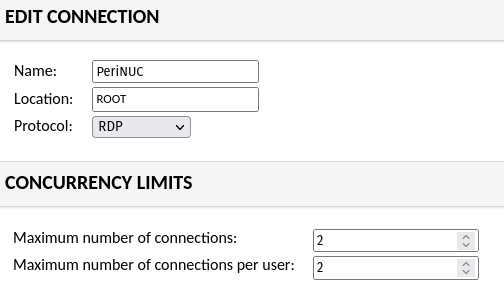
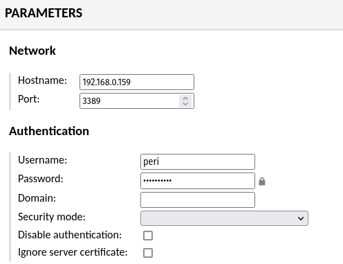

---
categories:
- Guides
- Tech
coverImage: image.png
date: "2021-07-15"
tags:
- anydesk
- apache-guacamole
- guacamole
- rustdesk
title: Guacamole - Clientless Remote Desktop access
---

I have been using [Anydesk](https://anydesk.com/en) for a while now to remote into my NUC workstation. It works great but for one big downside - It needs you to install the tool on both machines.  While looking for alternatives, I came across [Guacamole](https://guacamole.apache.org/) which is a clientless remote desktop gateway. Set it up on the server and you can access your desktops now from any browser! So technically, If needed I could access my workstation even from a hand held device. All I need is a browser that supports HTML5!

It literally took me five minutes to set this up. Here's a quick run-through:

- Install [Docker](https://docs.docker.com/get-docker/) and [Docker-compose](https://docs.docker.com/compose/install/) if you don't have that setup already
- If the server is a linux machine and you need remote desktop access, now might be a good time to check and install xrdp: `sudo apt install xrdp -y`
- Fetch the docker-compose file [from here](https://github.com/reisbel/guacamole-docker-compose) and follow instructions in the readme. You're essentially setting up the postgres database and then spinning up the guac and guacd containers.
- Once the containers are up and running, your Guacamole server should be available at `http://localhost:8080/guacamole/`

Now that you have a functional server, lets tweak the settings to make this a bit client-ready:

- Change the default login/password - duh!
- Navigate to Settings > Connections and add a new connection.

Under Edit Connection, add in a name and select **RDP**

Scroll down to Parameters and fill in details for your network and authentication.

Scroll all the way down and save. That's it! As you'd see there are [quite a few parameters](https://guacamole.apache.org/doc/gug/configuring-guacamole.html#rdp) that you can define for each connection. The above should however be sufficient to get you started.

Now that you have the server setup and the connections defined, you're ready to connect to the machines directly from any browser within the same network. Navigate to http://<ip address>:8080/guacamole, login and based on your configuration you will be either connected to the server directly or provided the option to choose from the connections available. To access the machine from a different network, you'll have to tunnel through which I'll probably cover in a follow-up post.
