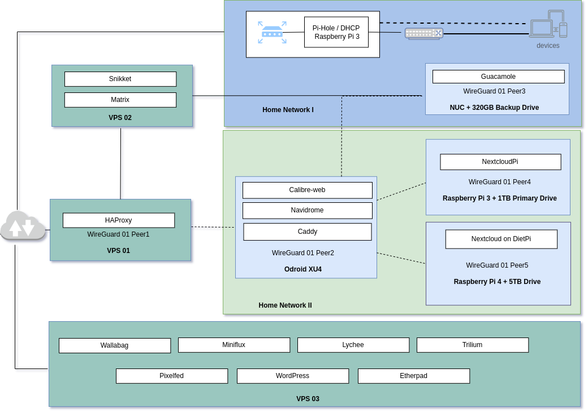

---
categories:
- Tech
- Tech
coverImage: wireguard-2.drawio.png
date: "2022-02-22"
tags:
- sotn
title: State of The Networks – Feb 2022
---

_A bi-yearly rundown on the state of the home-servers I run and applications I host on the cloud._ _Published while listening to: [Mist of Capricorn ( Manavyalakincharadate ) | Agam](https://invidious.snopyta.org/watch?v=zkvNnRjIhPE)_

A few major changes since the [last September update](https://srikanthperinkulam.com/2021/09/07/state-of-the-networks-sep-2021/):

- During the Jan trip, I moved the Odroid XU4 and NCP over to MD. Thanks to WireGuard, I can still access these remotely super seamlessly!
- Brought in the RPi4 NC to the same WireGuard network. Lesser maintenance!
- Not quite using the Navidrome and Calibre-web setup as much. Definitely nice to have though.
- Setup a couple [Matrix Bridges](https://srikanthperinkulam.com/2022/02/20/bridged/). Ansible is pretty awesome! Need to front the [Snikket instance](https://srikanthperinkulam.com/2022/01/25/snikket/) I setup in Jan when I have the mind-space.
- I think I'm liking Caddy better than Traefik!

Next few months, I'll probably focus a bit more on SSH hardening, implement more robust Firewalls and automating the backups.
