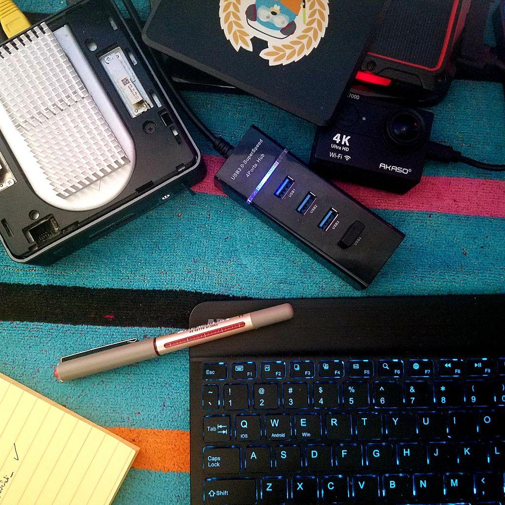

---
categories:
- Tech
- Photos
- Micro
coverImage: Imagepipe_9.jpg
date: "2022-03-06"
tags:
- intel-nuc
- micro
title: Tiny troubles
---

Of late, the NUC has been getting really hot. Core CPU temperatures were hitting the 80s despite the system being on literally no load. When I first bought it in mid-2020, I was aware that this lineage of tiny monsters were known for their 'hot'ness and the fan being a bit loud.  Only over the last few months have I really seen this sudden spike in temperatures though.

The first obvious step was to get rid of the plastic lid and get those aluminum heat-sinks. That helped a bit until yesterday when the temps shot to the 90s for no reason. A quick **htop** run didn't seem to show any processes that were hogging resources. Troubleshooting this a bit further, I figured I did run some apt updates a few days back that triggered Kernel updates. I might now have to get into the BIOS and see if any firmware updates are pending. As luck might have it though, the current keyboard that I have functions via Bluetooth only and I can't quite use it to get into the BIOS. I do have an alternate keyboard, again Bluetooth but this one comes with a USB receiver - which I conveniently left in my tech black-box in MD! 🤦 Really hope M doesn't forget bringing it!

For now, I installed the **cpupower-gui** tool and set the Governor to 'powersave' mode. Does seem to have done the trick for now. I might have to open up the unit and see if it needs some deep cleaning with some compressed air. Sometime soon I guess!

