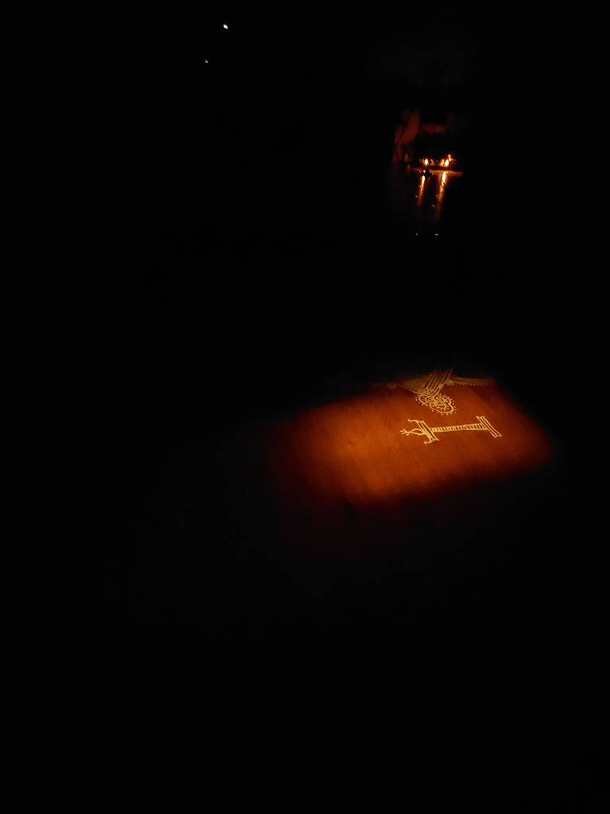

---
categories:
- Micro
coverImage: Satabhishekam.jpg
date: "2022-06-26"
tags:
- appa
- micro
- satabhishekam
title: "86"
---

As I walked up from the basement this early morning, I got to capture this beautiful picture of the light from the laundry room 'lighting' up the lamp from the Kolam. We performed Appa's Satabhishekam today. His sisters could attend the ceremony in person and a good bunch of family zoomed in. Until yesterday, we weren't even sure we'd make it in time for the event. Phew!

He's turning 86 this year! Several circumstances pushed this celebration until now and we're so glad we could make it happen today. Highlight of the event was undoubtedly the veda recital at the end of the ceremony. Wish we recorded it!
