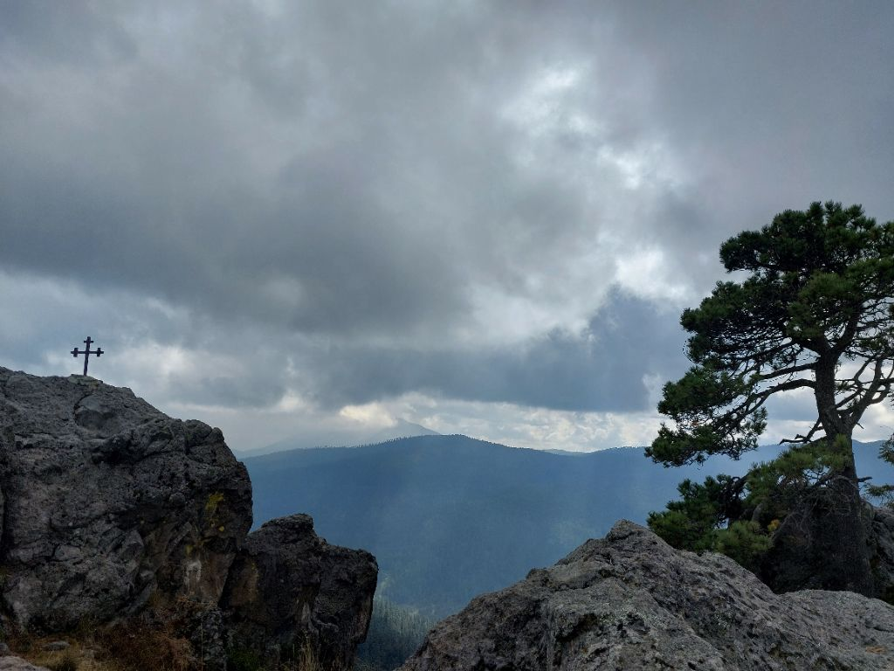

---
categories:
- Travel
coverImage: Imagepipe_58.jpg
date: "2023-12-10"
tags:
- cdmx
- hiking
title: Cerro San Miguel Hike
---

At 12,220 ft and after a 3-hour climb, it felt like home and more importantly I felt real strong. This was my first decent hike in quite some time now and I was pleasantly surprised my body wasn't really complaining.

Early this month, M and I spoke about getting back into the hiking circuit. It's been about 9 months that we've moved to CDMX and we've covered a decent bunch of the touristy stuff. CDMX has so many good hikes to offer and quite a few are reasonably accessible from the city limits. With work-travel, visitors and other schedule conflicts; we felt it was reasonable for us to fit in one camping trip and one exploratory hike very month.

I chanced on Di's [post on hiking Cerro San Miguel](https://slightnorth.com/desierto-de-los-leones-cerro-san-miguel/) from Ex Convento. She had some great pointers on the trail and coupled with the AllTrails app, this was a super easy trail to navigate. We did summit Cerro El Caballete on the way to Cerro San Miguel. Weather was just right and we barely ran into three or four other people on the way up. Was a treat to see MTB bikers literally flying downhill on those steep gradients. Wouldn't think twice to come back here!
