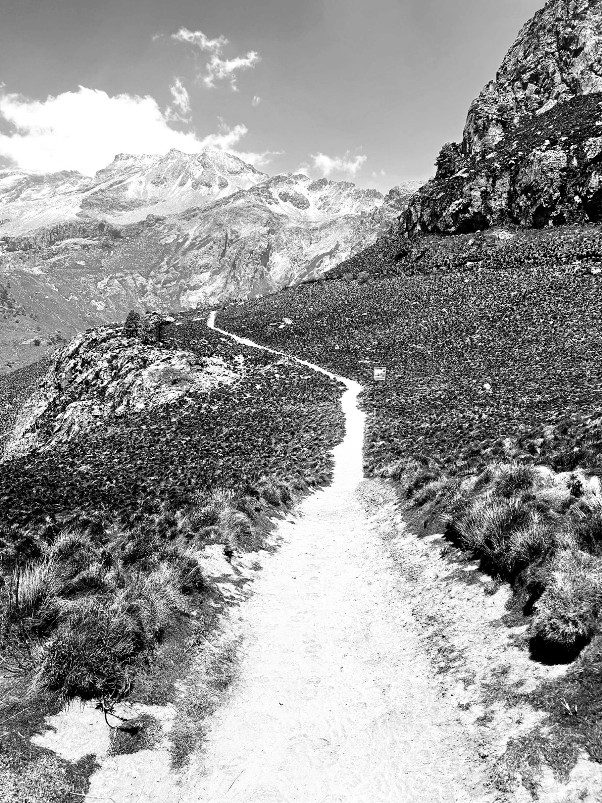

---
categories:
- Travel
coverImage: 20240412_0649293003591195629761476.jpg
date: "2024-04-12"
month: 2024-04
tags:
- hiking
- izta
title: Izta Attempt
year: 2024
---

Got my ass royally whooped last weekend on Izta. The plan was to camp at La Joya until 0000 on Sunday and push for the summit by 0800. With around 4500' to climb, I knew this would be challenging. What I was not ready for, was the elevation sickness that hit me at about 14000'.

La Joya is at around 13000'. We got here around 1200 on Saturday, setup camp and did a short 1.5 hours acclimatization hike to Portillo 1 and got back to La Joya for dinner and rest around 1600. I'm usually able to sleep well despite the surroundings. Today however, I sense a mild headache and am not quite able get much sleep for some reason.

We break camp around 0000 on Sunday and start the climb. As we reach Portillo 1 in about an hour I do notice I'm hurting a bit. It wasn't this difficult last evening. A short break here and we head up to Portillo 2. Marco our guide checks on how we're doing and I tell him - Today's not my day. The headache from last night lingers and I feel a bit queasy. First sign of altitude sickness hitting me. I ask if we can slow down the pace and keep moving. At Portillo 3, I'm laboring and for a moment I think I saw M climbing down. That can't quite be true because she never did come on this hike. I eat a couple nutri bars and suggest I stick right behind Marco as we climb the loose soil gradient towards Portillo 4. Around 15000' I start feeling a bit dizzy and take a call to turn around. The group agrees and I stay real close to Marco just focussing on his feet movements. It's still pitch dark. On the way down, a group of hikers attempting the summit wish us a good hike and trudge along in the opposite direction. As the last person in the group crosses me, one look at her and I realise its M and I turn around and follow her. Only issue being - it's not her. She never came on this hike. I snap back into reality when Adam checks in on me questioning why I'd turned around. And this is when I realise my altitude sickness is getting worse - quicker. I take a couple minutes to gather myself and we attempt to scale down the peak as quickly and safely as we can.

At Portillo 1, we get some well needed rest. The sky is free of any pollution and all we see is beautiful stars strewn all over the pitch black sky. Shooting stars and satellites galore! I wish I had a good camera to capture this all. But then that would still do no justice to the magnificent show the universe was putting up this morning.

Though we didn't quite summit and Izta is yet to checked off the list, It's been quite an eventful night. With sufficient rest at Portillo 1, I feel much better and literally run down the last section of this trail. We reach La Joya by dawn break and make our way back to CDMX.
