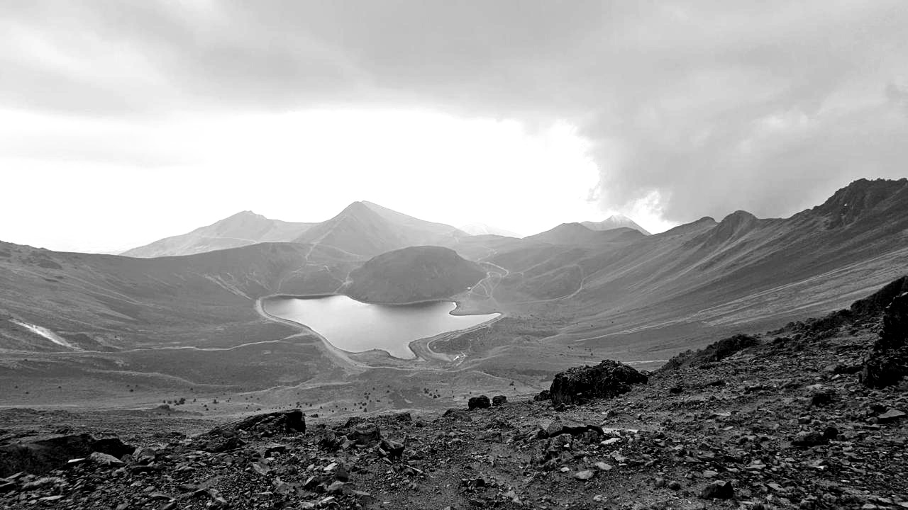
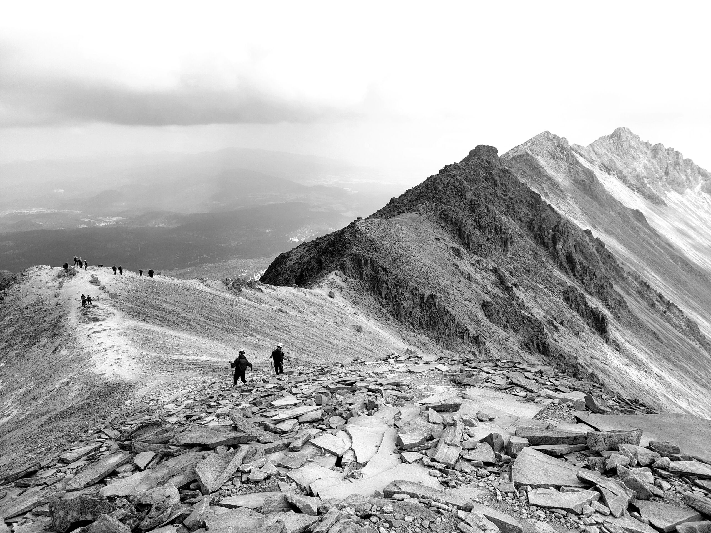
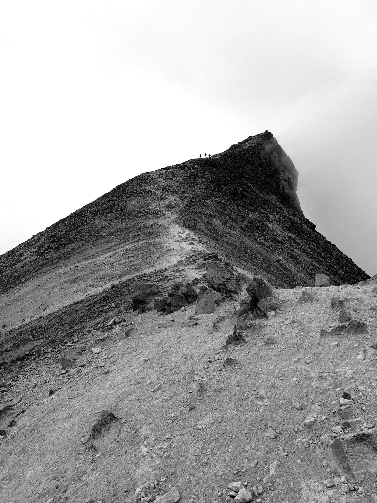

---
categories:
- Travel
coverImage: 20240422_163850.jpg
date: "2024-04-23"
month: 2024-04
tags:
- cdmx
- hiking
title: Nevado de Toluca
year: 2024
---

I'm writing this, sick to the core at 0300, rallying between sweating out the sheets and freezing to the bones. It's been a rough couple days. Oddly enough I didn't feel one ounce of pain during the alpine hike I did on Saturday.

We summited Nevado de Toluca on Saturday and this would be one of my best hikes so far. Just two hours from Mexico city, this hike has something for everybody. First off, just getting to the alpine lakes from the base, which takes about 20 minutes, opens out the playground. One can literally see the whole terrain and trails that surround the pristine alpine lakes. We decide to head clockwise and summit Pico del Fraile (15388'). The climb up is reasonably straighforward and its mostly choosing your path to get to the peak.

Once at the peak, instead of scrambling downhill to the lakes, we decide to complete the loop and summit all the other peaks in that circuit. For the next 4 hours we're trapezing the peaks, scrambling up and down paths of our choosing. It's windy but not unreasonably cold. A thunderstorm looms further on one of the peaks and as we make plans to find cover under the rocks a mild hail storm hits us. Thankfully, our helmets protect us and we make decent progress towards the other peaks.

The sound of conch shells and drums give us constant company - From high up here at 15000' we see a group of about 30 people performing some ritual near one of the alpine lakes. As we push for the final descent we somehow loose our trail. All we're left with is super loose soil and huge stones at a 80° gradient. There's barely any grip here and we're at the mercy of luck as we make our way down. Finally at around 1500 we reach the base and wait for the transport truck to take us down to the actual base.

This hike was such a contrast to Izta. Izta felt like just a suffer fest with barely any rewards while Toluca offered some terrific views right from the start. I'd repeat this hike in a heartbeat!

* * *

2024-04-20 07:39:31 - **Nevado de Toluca** 🥾 Hiked 6.07 miles in 06:39:57 Pace : 65.89 min/mile. Elevation Gain : 2611 ft. Elevation Loss : 2613 ft. Calories : 1037 Location : Toluca 💓 : 90
