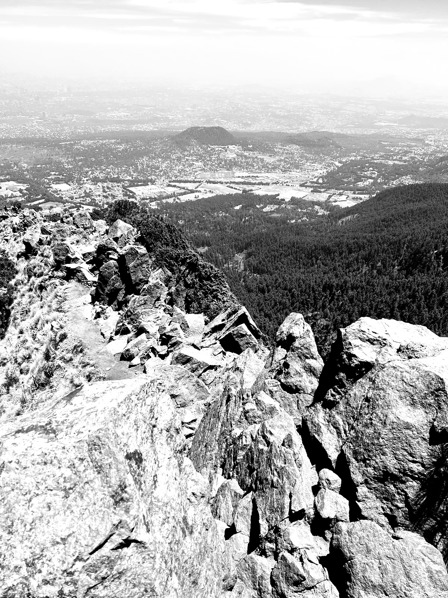

---
categories:
- Travel
coverImage: signal-2024-04-14-17-12-24-029-2.jpg
date: "2024-04-14"
month: 2024-04
tags:
- ajusco
- cdmx
- hiking
- micro
title: Pico de Águila
year: 2024
---

S was having a rough day on Saturday and was scrunched up against me all day. Around 1900 I checked my work phone and saw that Mo had texted earlier that morning asking if I would be interested in hiking Pico de Aguilar the next day. I wanted to confirm immediately but given S's health I wasn't quite sure. Decided to take a call the next morning and hit the bed. Thankfully, on Sunday morning, S seemed to have almost recovered and I decide to head out to meet Mo at his place. With some starting troubles (literally!) we finally leave for Ajusco around 0830.

The drive up is super straightforward and we park at the trailhead around 1000. We decide to take on the steeper parts of the climb first going clockwise. Around 1200 we reach Pico de Águila (12596') and in another 30 minutes we summit Cerro La Cruz del Marquez (12871'). The way down from the Cerro was super steep at an 82° gradient. So glad we decided not to climb up from here and note to self to bring a knee brace for these downhills next time I hike here in CDMX. The loose volcanic soil and incessant pebbles make for dicey path downhill. We finish the hike at around 1400 and relish some hot cakes at one of the shacks at the base.

More than anything, this hike was a major morale booster after last weeks Izta attempt.

* * *

2024-04-14 09:43:52 - **Pico de Águila et Cerro La Cruz del Marquez** 🥾 Hiked 4.69 miles in 04:50:29 Pace : 61.94 min/mile. Elevation Gain : 2405 ft. Elevation Loss : 2384 ft. Calories : 1810 Location : La Magdalena Contreras 💓 : 152
