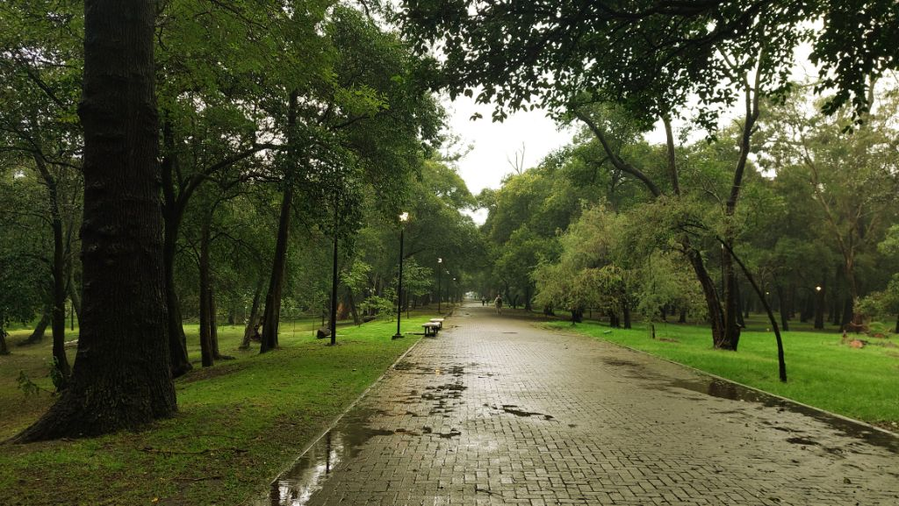

---
categories:
- Running
author: SSP
date: "2024-09-28T21:54:52-06:00"
id: 63175
image: Bosque De Chapultapec
layout: post
month: 2024-09
title: Woken
year: 2024
---

M taps me slightly and points to the window. I’d mentioned I would go for a run if it starts raining. I’d probably slept for about an hour? Not sure when I fell asleep. Must be the sugar high from the petta that M got from Vancouver. I quickly change and head outdoors. It’s pouring but not as much I’d like it to. Hopefully it’ll pick up soon. It’s real dark and cloudy. The GPS on the Forerunner 250 barely registers any signal. I walk fast and head further west on Polanco towards Ferro Carril via Homero. Reach the biking path by the rail line and bear left. It’s pouring. Decide to pick up some pace and essentially run up on all the foot bridges. There’s barely anybody else on the trail. This is awesome!

As I cross Club Naval on the right I see a sign for scuba diving classes. We saw ZNMDB this afternoon and now this ad. Got to be a coincidence. Maybe I’ll swing in a few dives in Bacalar? I swap my ear buds out as *The Emptiness machine* tapers down. That pitch! Reach a junction where I need to decide if I should head towards Santa Fe or head back home. Maybe I could make this an impromptu 15 miler? I’m about three miles in. Decide to bear left and head towards Campo Militar. There’s quite some crowd here. Looks like the Saturday market is bustling with activity. Oh that smell of firewood smoking some delicacies! I’m almost sold on stopping and getting a hot cup of coffee. I’m bone wet and good cup of coffee won’t hurt? Decide against it for whatever reason and head towards Chapultapec. Maybe I should turn left and head towards Paseo de Reforma? Nah, the park is literally empty and I could possibly get a few more miles in. I head towards the Castle and then the Independence monument. I should probably try and find that spot where those two super old hand carts are on the road. Maybe I might get a real good shot? I just can’t remember where I saw it the last time. Well…the rain’s flooded the roads and you can barely see anything. I run across the 200 or so meters of flooded road hoping not step in an open manhole. Can’t be that bad…

About four miles in. I cross the road and head towards the Museo de Antropologia. Tlaloc is definitely showering his blessings today! My legs feel good. They’ve always felt strong. But for that niggling knee pain. Maybe I should get it checked out? I should run more frequently. Maybe I won’t have this luxury in Yaounde. Why does it take so much effort to workout? Need to work on that tiny belly showing up…and maybe some upper body strength too? Get that climbing membership? I’ve got only five months left. And then all this work travel. Should probably just focus on Ashtanga. I think I’m – so close – to making that into a habit.

Oh this city reminds me so much of Pune. The monsoon, the lush green parks, the people, the smells…. I’m so glad Pune happened. Some real great memories were made there. I’m sure it’s not all the same now. Someday I should go back and reach out to all the people I led on the trails. Maybe they are still hiking somewhere? Would they even remember me? Or maybe I just shouldn’t and let the photos tell the tales. More thunder rumbles in. I’m about two miles away from home. S is probably up and my tummy is rumbling a bit too. Damn. I should have gotten that coffee and soaked in more of that burning wood...Next time I guess. I cross the Miguel Hidalgo sign and finally head home clocking around seven miles. What a terrific evening. So glad M woke me up.