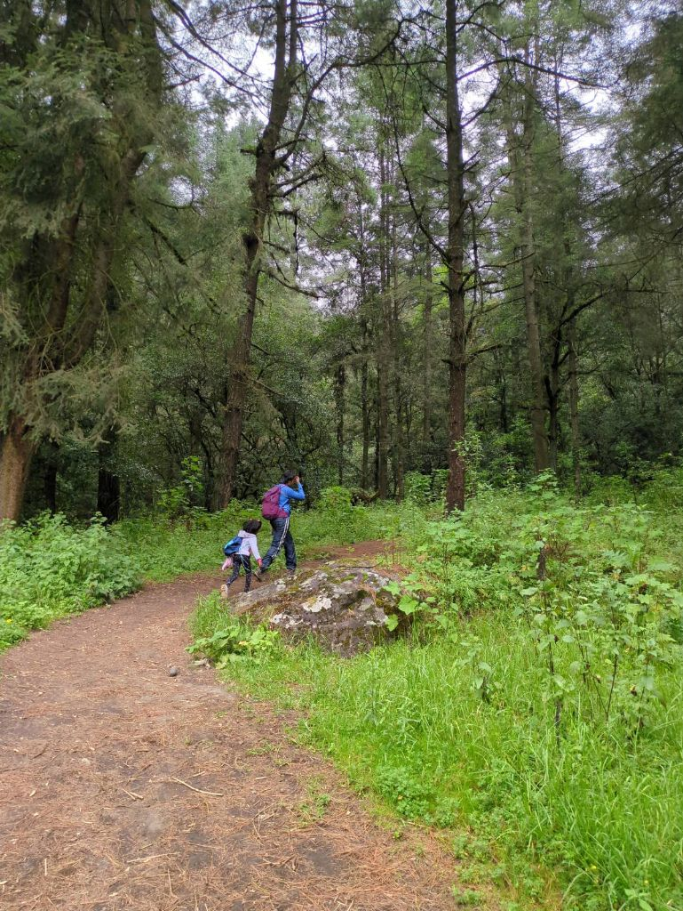

---
categories:
- Travel
author: SSP
date: "2024-10-17"
draft: false
layout: post
month: 2024-10
tags:
- Hiking
- girl-scouts
- CDMX hikes
title: Cascada de la burbuja
year: 2024
---

Spent a good few hours out in the woods along with the girl scouts. M is not a leader this year so we took a step back and had a great time just enjoying the outdoors. S had a slow start and was heavily resisting for the first hour or so. She suddenly flipped once we reached the mid point and didn't want to stop! She clocked around 5.2 miles in 3 hours and this would be one of her longest hikes in quite some time now! Super proud and she did earn her ramen!

The waterfall and the trail per se were beautiful with quite a few switchbacks on the stream fed by melt water from the Iztaccihuatl volcano. The approach road to the trail-head was quite beaten and the Vitara handled it real well. 