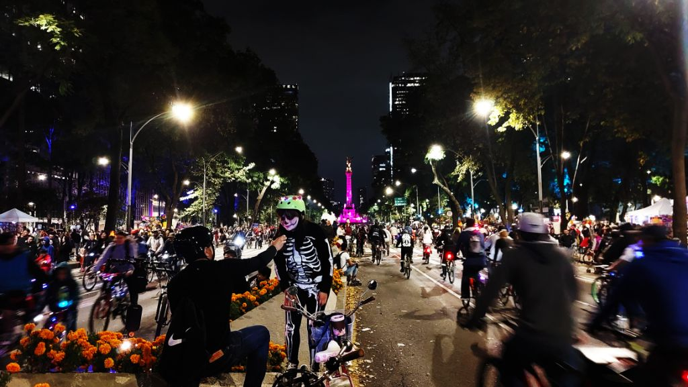

---
categories:
- Biking
author: SSP
date: "2024-10-26"
draft: false
layout: post
month: 2024-10
tags:
- CDMX rides
- CDMX
title: Dia de muertos ride
year: 2024
---

Took the bike out for a spin right after the CLO trick or treat. Reforma and parts of Centro Historico were closed out for the monthly night ride and this one coincided with Dia de muertos. Quite a few people showed up and most of the route was a huge bicycle jam. Nevertheless some good time out on the roads in the nippy weather. Clocked around 11 miles. 