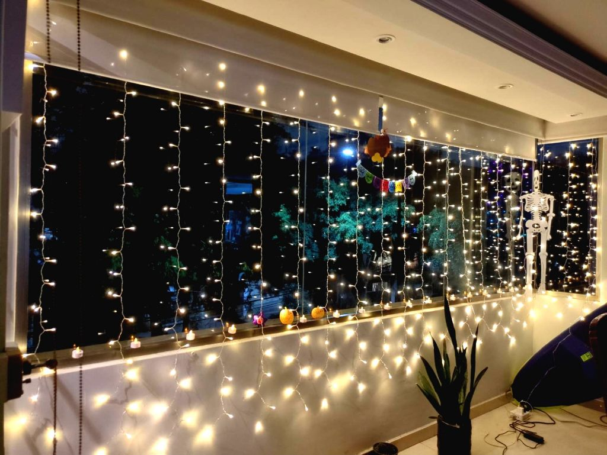

---
categories:
- Family
- Photos
author: SSP
date: "2024-10-31"
draft: false
layout: post
month: 2024-10
tags:
- Diwali
title: Diwali
year: 2024
---

Being overseas and not having access to firecrackers, this festival is just not what it used to be. I wish I could go back to those days when we would try and wake up before Kitta mama would burst his 1000 wala before the break of dawn. Days when you yearn to wear those new set of clothes - The only time of the year when you get new clothes and not hand-me-downs. Days when you make a TON of sweets and savories to share with family and friends. Days when you would hop into people's houses uninvited to see what special delicacy they've made. Days when every single house is lit up and the smoke of firecrackers permeate everything. Such good memories....

Diwali this year was super low key. We did light up some *Diyas* and M had ordered some savory snacks from one of her local contacts. A few calls to family and I think we called it a day. Times when you miss being amongst family and friends. Happy Halloween and Diwali - I guess?