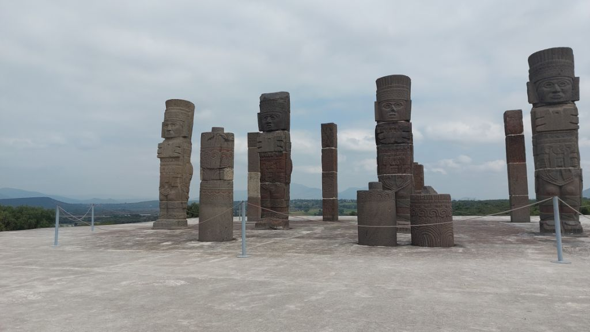

---
categories:
- Travel
author: SSP
date: "2024-10-28"
draft: false
layout: post
month: 2024-10
tags:
- tula
- CDMX
title: Tula and Tepozotlan
year: 2024
---

Took a couple days off work for a short break. M flagged a quick trip to the Tula ruins. Just about a couple hours from the city, these ruins were a nice quick visit. There was barely anybody out here as opposed to the crowds at the Teotihuacán pyramids. On the way back we did a quick stop in Tepozotlan for brunch. 

Once back in the city, S wanted to roller blade and we head to Parque Americana for some good wheel time. I'm so glad we got these rollers! I'm definitely getting better at it.