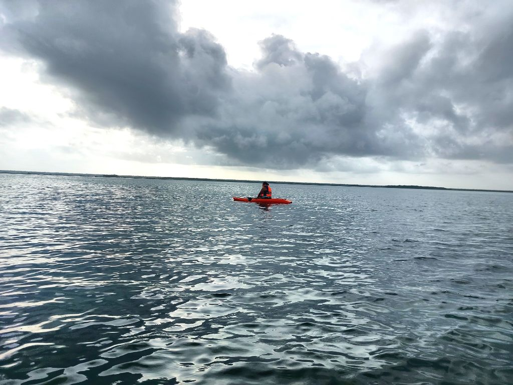
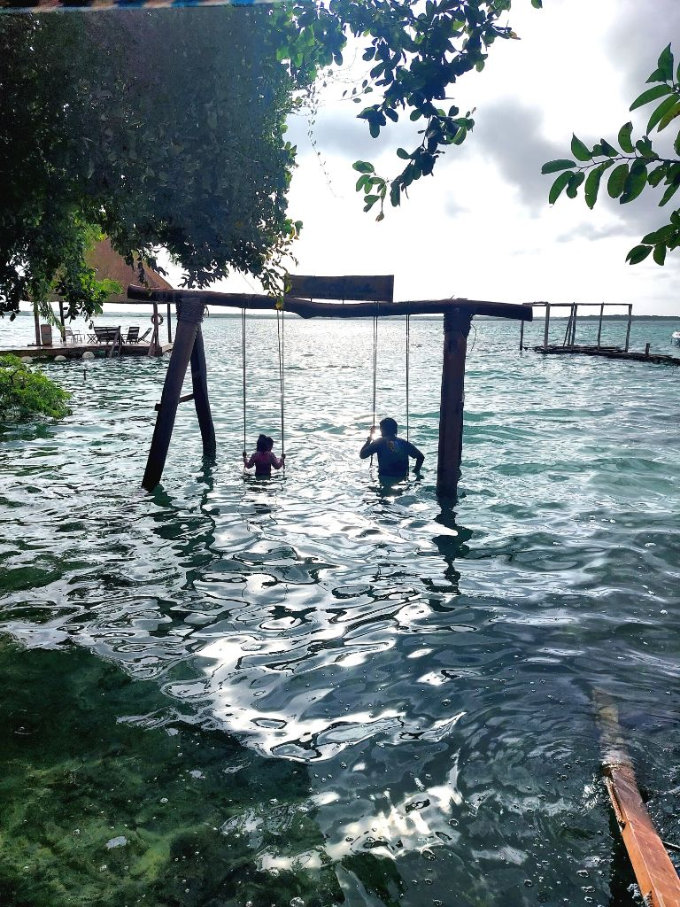

---
categories:
- Travel
author: SSP
date: "2024-11-18T21:30:00-05:00"
draft: false
layout: IWArticle
month: 2024-11
params:
  IWkind: macro
  syndication:
    fediverse: ""
tags:
- macro
- Bacalar
- CDMX
title: Bacalar
year: 2024
---

  
Bacalar has been on our travel list for quite sometime now. Between work travel, syncing our individual schedules and just getting around to actually booking the trip; we finally get around visiting this beautiful place this weekend in November.
  
As we get off the plane, we're immediately hit by a waft of the Yucatán humidity, soon followed by thick droplets of rain. Strikes me just then that we're also right in the midst of the hurricane season. A quick lookup on the weather forecast reveals Hurricane Sara would be swinging past us and into the Gulf of Mexico in a bit. I slap myself on my wrist for not doing any research beforehand but also shrug this _minor_ oversight very quickly. How bad could it actually be? Maybe some showers here and there? We walk outside the Chetumal airport for about 500m and take a taxi from the main road to Bacalar. Oscar offers to take us there for 550 pesos. This was about 50 pesos shy of the amount the tour planner had quoted. M immediately accepts and we're on our way. First impressions of this place immediately remind me of Trivandrum - lush green vistas with coconut trees strewn all around, narrow roads and barely any traffic. There's construction for Tren Maya happening along the route but it barely impacts our drive. In about 50 minutes we reach the hotel and check-in.
    
S immediately comments on the smell of wood as we enter our room. She's ambivalent of the smell but seems to love the room setup. She goes around exploring the windows and shower. Once we get settled in, we head out to explore the property a bit. Hotel Carolina looks good with the woodsy feel and being right on the lagoon - but it definitely feels more commercial than I had imagined it to be. Yet another slap on the wrist. Note to self not to go by just pictures next time around. Maybe this trip planner thing is not quite working for us? This is the first time in all these years we're using one - An embassy colleague's wife runs a dive business and plans trips for folks across central America. We thought we'd give her a shot for this trip. Anyways, the stomach rumbles and we head over to Mango y Chile - a quaint vegan restaurant right by _Fuerte de San Filipe_ about 30 minutes walk from the hotel. The burgers and smoothies here are super delicious and we finish it off with some paletas. M's restaurant picks barely go wrong! Back to the room and we settle down for the night.
     
Around 0730 we stir awake and quickly get ready for the day. Plan is to head over to the fort to meet out boat captain who's supposed to take us for a two hour ride in the lagoon. M messages the tour operator to check if the plan is still on since it's super gloomy and heavy outside. She confirms and we head over to the fort. Just as we get to the fort, the skies let loose and the Boat captain gives us news that the police have closed the port for the day. We're obviously disappointed and decide to grab a quick bite closer to the hotel. I offer to carry S on my shoulders as we make our way back in the pouring rain. The roads are flooded and the rain isn't showing any signs of letting go. Love this walk back and it's been quite sometime that we've actually done this! Some good breakfast at Noru's and we make our way back to the hotel. M suggests we should probably consider getting back to CDMX that afternoon. Unfortunately, there are no tickets available on the flight. With that decision made for us, we decide to head back out for lunch at _Enamora_. Food here's okay. As we make our way back to the hotel, the weather clears up a bit. S wanted to head to the kids pool and we nudge her to try out the swing in the water. _Sara's_ effect lingers and the water is super choppy. We try getting the kayak out for a bit but aren't quite successful. Back to the room and we spend some good time in the portico by the hammock. After we're back from dinner at _Noru's_, I nudge S to head back to the wooden pier by the lagoon. We spend some time here as the sun sets and S plays with the idea of getting the kayak out. She flips it over in an instant and wants me to get in the water instead. The water does seem way calmer and I hop in to explore the waters. This impromptu wade in was probably one of the highlight's for the day. We head back to the room. S spends some more time on the hammock and quickly falls asleep. M and I tinker with the idea of taking the kayak out the next morning to explore the lagoon by ourselves. As I type this at 0326 on Monday, I'm actually super psyched about this plan. Hoping S is game doing this in a few hours! 
    

    
And she is! We quickly change over in the morning and take to the waters. The weather is just right - Dark clouds hanging above and rays of sunshine creeping down. The water is much calmer and we're near Cenote Negro in no time. We wade in the waters for about an hour and steal a few more minutes by the swing. Around 1030 we finally checkout and head to the airport after a brief breakfast stop at _Ajal_. 
    
While we didn't quite get to explore the whole lagoon, I'm so glad we ended up staying for the extra day. Overall S thoroughly enjoyed the water and just lazing in the hammock. Lesson learnt though that we are best at planning our own trips and can't wait to head to Baja California later this December!