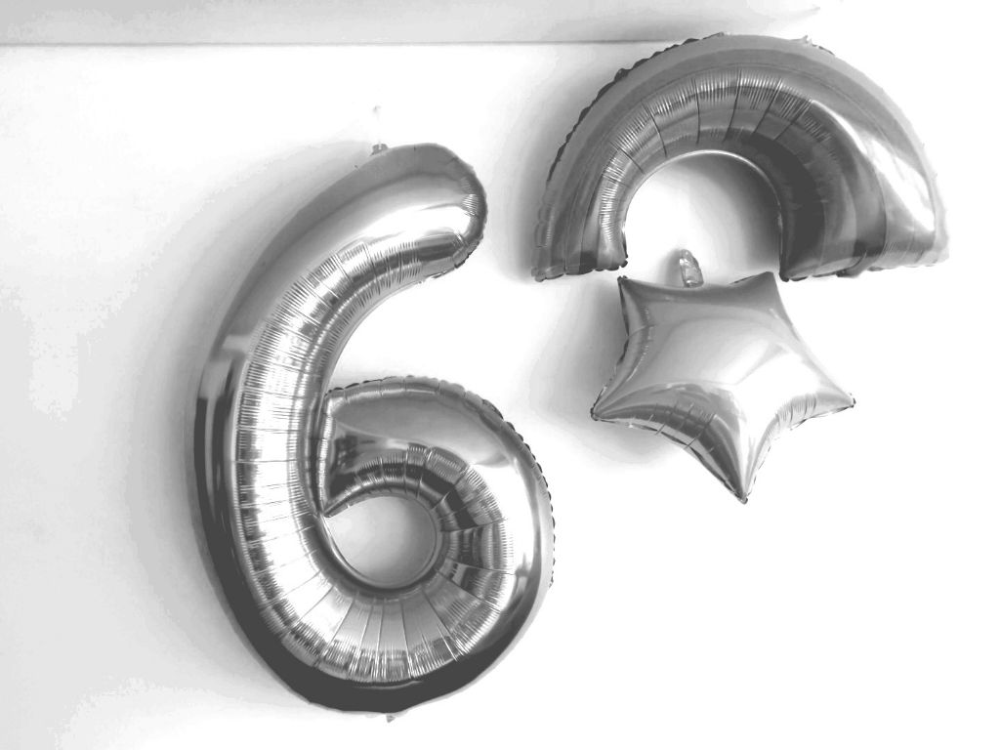

---
categories:
- Week-notes
- Family
- Misc
author: SSP
date: "2024-11-11"
draft: false
layout: post
month: 2024-11
tags:
- CDMX
- shasta
title: Sixth
year: 2024
---

S celebrated her 6th today.  Unicorn themed - of course - and had her first and probably last ever Piñata. But for a mega meltdown initially she did great all through the event. 

A few weeks ago, we signed up for a Diwali party organized by the Indian Association in Mexico. Primarily on a whim and maybe for the food? The event was last evening and boy, it was a terrible disappointment! It started late as expected. And obnoxiously loud for no reason. Not quite sure if it was the acoustics at the venue or just the MC shouting into the mic.  Maybe both? I love some good rock and metal. I love some good loud music. But I guess not all loud is the same. Also, this day and age, who even does a looping slideshow of pictures of people organizing the event? Dinner was supposed to be served by 1900. Servers said they had orders to serve only at 2030. Maybe the organizers wanted the food to be served only after the main event? When we rechecked at 2030, they said it was pushed to 2130. Had enough of it and walked out.  People were still on the dance floor and there was a good turn out. I guess this kinda boisterous social mayhem is just not my jam?

We head out to a Japanese (?) restaurant in Polanco since Nimi's, Mei Mei and Manaw were all closed for service. Sushi was *meh*. S did great all through the evening though despite the loud music and the crowd. That 'Sticker by number' book that she received as a gift from Maddy kept her fully occupied!

Monday morning here and S is off for school. She was mildly upset that I get to stay at home while she needs to go to school. Fair world logic, I guess. We drop her and get to spend a couple hours together watching *Spenser Confidential*. Enjoyed it all the more because we recognized quite a few locations where the movie was shot. M's got some brunch out with the ladies in a bit and then a couple more hours before I need to pick up S. Maybe I should tweak that 3D printer?