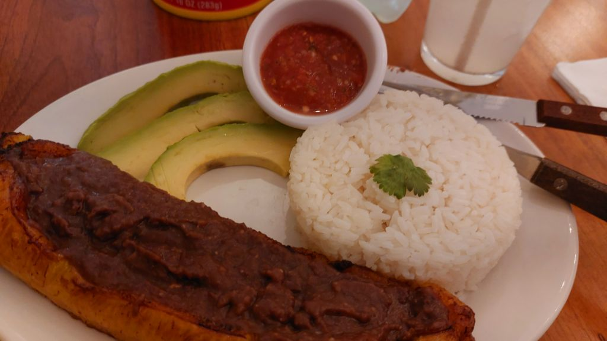

---
categories:
- Travel
author: SSP
date: "2024-11-16T21:30:00-05:00"
draft: false
layout: IWArticle
month: 2024-11
params:
  IWkind: macro
  syndication:
    fediverse: ""
tag:
- macro
- Merida
- CDMX
title: Spanglish
year: 2024
---

Back to the Yucatan for a work trip. Too many variables to factor in and ultimately I decided to head here for just a couple days. Short but super productive. Nothing to beat some good facetime. 

The new building here is at a much better state than Hermosillo and we should be quite ready for the move next year. Spent about a day at the NCC and head back to the COB to close out a few things there. Wasn't quite hungry but decided to walk over to a quaint place closeby. Barely anybody at this Puerto-Rican restaurant - Spanglish, but boy am I not glad I walked in? One of the best meals I've had here in Merida in a while. Salsa with some piping hot white rice served with some steaming hot platanos glazed with baked beans paste. Simple yet -potent- with flavors and spice. Surprised we did not quite visit this place over the last year. Coming back here for sure! Missed going to the Korean place this time around for the ice-cream. Spanglish more than made up for that though.

As timing would have it, we'll be back to the Yucatan this weekend for the Bacalar trip. This one's been on our list for a while now and we are super looking forward to it! 