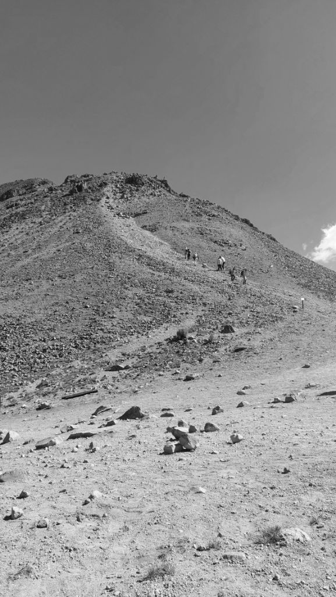

---
categories:
- Travel
author: SSP
date: "2024-11-24T21:30:00-05:00"
draft: false
layout: IWArticle
month: 2024-11
params:
  IWkind: macro
  syndication:
    fediverse: https://chat.srkn.org/@ssp/statuses/01JDR66N4HSAVMB2YM41Z0ME6V
tags:
- macro
- Hiking
- CDMX Hikes
- Nevado de Toluca
title: Arista de Humboldt
year: 2024
---

A few weeks ago I sent out a poll to the ESC group to gauge interest in a group hike at Nevado de Toluca. There was reasonable interest and we slotted this to be a family hike on the 24th. The Padilla's and Johnston's had to drop off last minute. It was just going to be Hadley and the Arturo's now with the three of us. We reached the Shuttle point around 1015, hopped in a shuttle and got to the trail-head around 1100. Couldn't wait to hop off the shuttle - the gasoline stench coupled with the super dusty windy roads was more than churning my tummy. S did terrific with no complaints!

This time around we had to pay 65 pesos/person to enter the park. Very nominal and I guess it might be to control the crowd. I've never seen Nevado de Toluca this busy! We trot up from the campamento towards Arista de Humboldt. I compromise with S before-hand that I'd carry her on sections when I can. Boy, she is getting heavy - *big and strong* as M would like me to phrase it. We reach the viewpoint in no time.  This place is so freaking beautiful. Even with the almost ten fold crowd than usual. 

Houss is definitely feeling the altitude ~14,060 ft. M is slowly warming up and S wants to head back to the trailhead. We decide to split the group here. The girls head over to scale one of the shorter hills on the right while the three of us head up the steepish peak on the left. In about twenty five minutes we reach to the top of this knoll and decide to turn around. At about 14,550 ft. oddly, it was way warmer than the lower elevations. A quick trot down to the rim and we decide to head back to the trail-head. The shuttle back from the trail-head is in a beaten Chevy pickup truck. We're smothered with loads of fine dust as it zooms down the hill. S takes a mini-nap and wakes up just as we reach the car parking spot. A quick hour and a half and we're home for a slow Sunday catch-up.