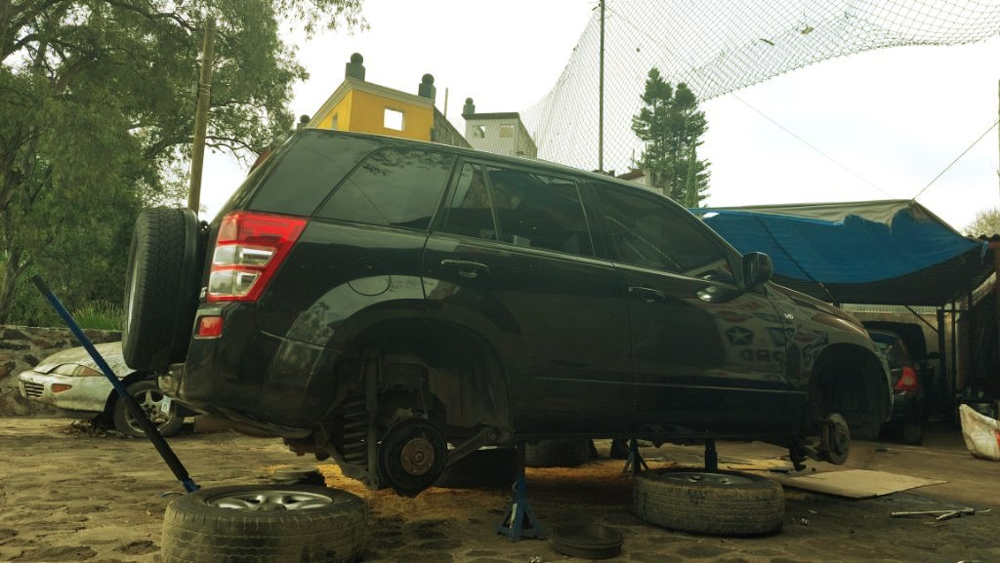

Downhill and no brakes, what fun! Definitely not at that moment though. Somewhere near Cuernavaca, The Grand Vitara had a brake fade [^1] this morning on our way to Las Estacas. The brakes would just not work and it felt like I had to pump it to get even a bit of traction.  Got  super close to hitting the car in front of us but thankfully, I found a small lane (ditch?) to veer off from the traffic and engine braked it to a stop. Super lucky none of us were hurt and we were able to veer away from traffic just in time. Also lucky that this happened just about 100m from a mechanic shop! What are the odds? Took them about three hours to do a ~~thorough~~ check on all four wheels and fix the oil reservoir tray - which they broke while jacking the car up. Oh boy, what a start to this years' Christmas! 

Immediately after we were able to get the vehicle to a stop, M asked if it was the floor mat that was the culprit. Nope - I'd removed them a few days after we bought this car. All thanks to another [dreadful experience](https://srikanthperinkulam.com/2016/04/26/the-grand-cherokee/) several years ago in the Grand Cherokee. 

Ignorance and oversight only make sense in hindsight.  About fifteen minutes before this incident,  I did notice the brakes feeling soft and remember thinking - that's odd the brakes worked just fine so far. Also maybe I didn't notice the smoke from the tires because we were driving through quasi dirt roads? All signs of the brakes giving in - had I known about brake fade then. Wee bit wiser now I guess? 

[^1]: Apparently that is the [technical term](https://en.wikipedia.org/wiki/Brake_fade) for a failed brake.