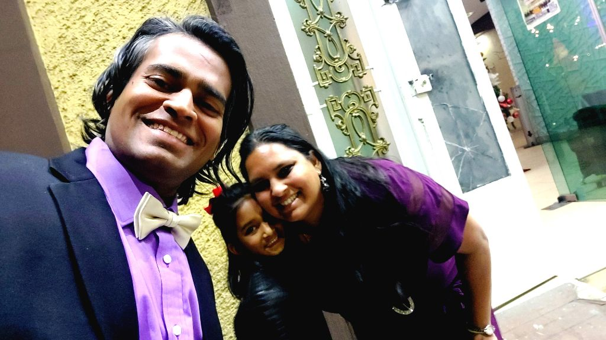

We decided not to drive to GDL for Carlos' wedding. Just not comfortable driving the GV until we get it properly serviced. Thankfully, we got a flight last minute and we head straight to the GDL zoo after landing. S has been wanting to see the penguins there for quite sometime now and what better opportunity than this?

The zoo was immaculately maintained! And with the Sky-cables and trains, this was such a great experience. We checked in at the AC hotel for some short down time and then head to an Arabic restaurant for some pretty delicious wraps because we were quite certain M wouldn't find anything vegetarian at the wedding. The wedding per se was super intimate with about 30 guests. I am glad we were able to fit this in despite a pretty packed end of the year. We head back to the hotel around 1145 just about when S was nearing her *I'm done* limit.

The next morning, we head to the vegan restaurant that M had scouted for a quick breakfast and get to the GDL airport just in time for the flight back to CDMX.
