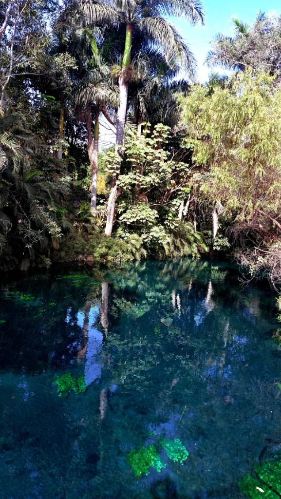
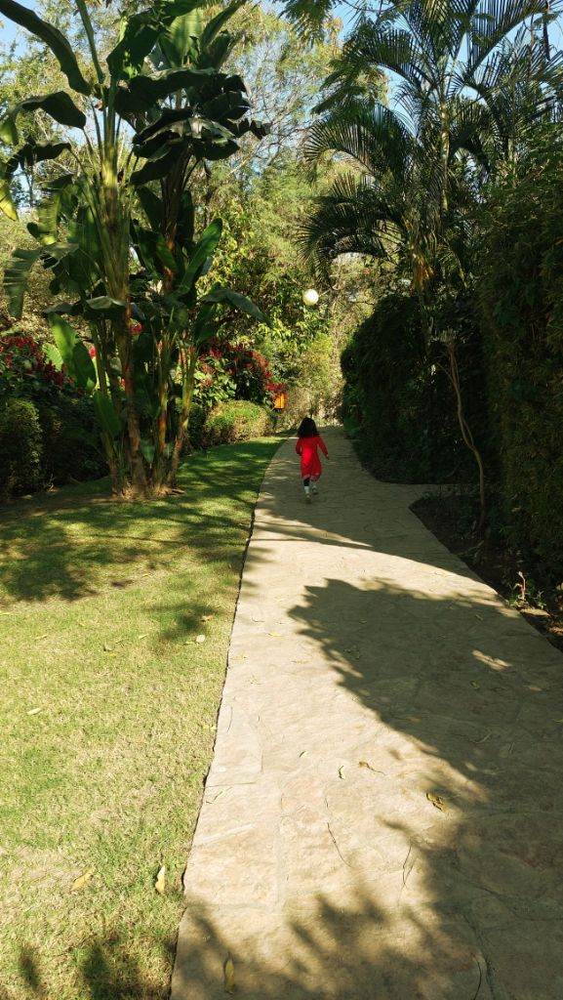

V+D were visiting us for a few days around Christmas this year. With the 24th declared a holiday, M suggested we go glamping in Estacas for a night. S loved the idea and we booked two tents for the five of us. Cost was super reasonable given it included breakfast and entry to the park.

We only got to Estacas around 1400 on 24th evening thanks to the four hours we lost to the [brake fade on the Grand Vitara](https://srikanthperinkulam.com/2024/12/24/brake-fade/). After a quick check-in, we decide to rent a kayak and row down the stream. I hop off the kayak and swim upstream. S was bent on going to the kids pool alone and not getting into the spring. After about an hour, S & I head to the kids pool. She spends maybe 30 mins in there and calls it a day. Her only ask was that we have dinner by the spring, which we gladly agree to since that's the only restaurant that was open. After dinner, S was sleepy but still super excited about spending the night in the tent. Happy kid, Happy camper! She sleeps through the night despite all the Christmas fireworks.

We wake up to a super crisp and nippy 25th morning. V and I decide to snorkel/swim in the warm 23C spring water. We spot some sleeping turtles and a great many schools of fish feasting on their morning find. After a simple yet delicious breakfast we make our way back to CDMX. Probably one of our best stays in Estacas so far and I'm so glad we decided to glamp! Though S didn't get into the spring, she absolutely enjoyed our trip. 