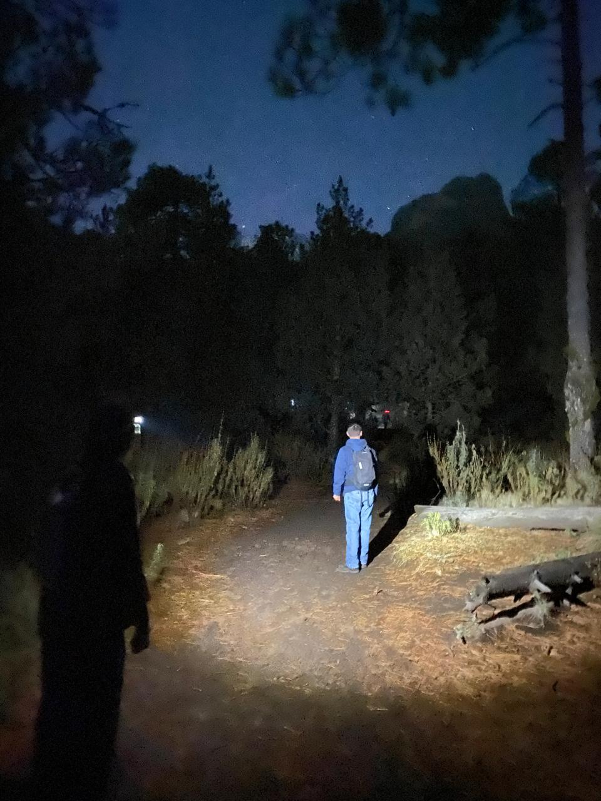
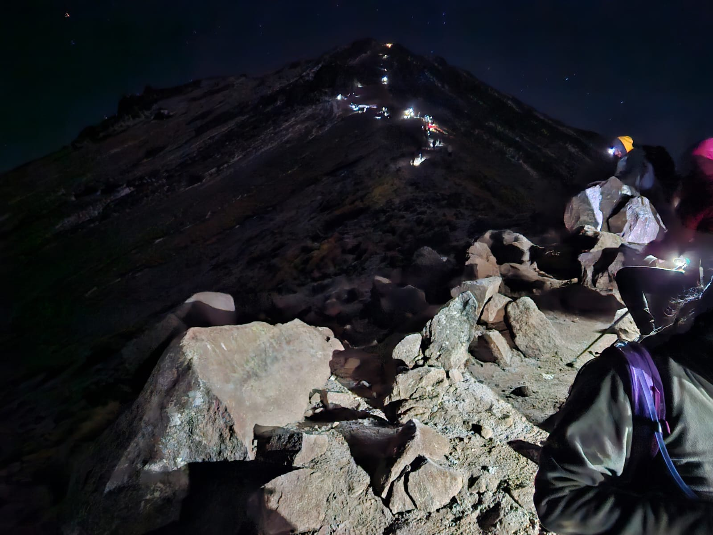
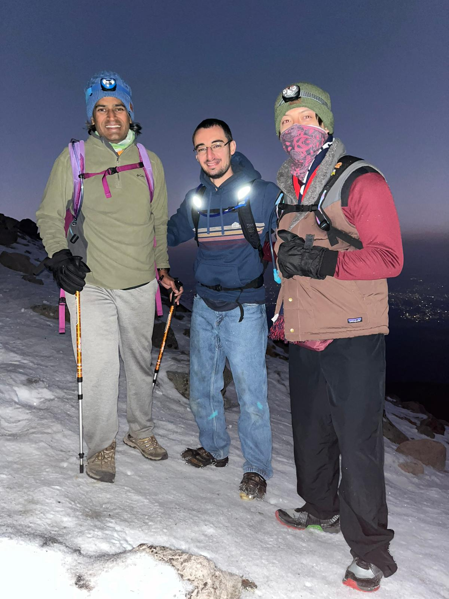
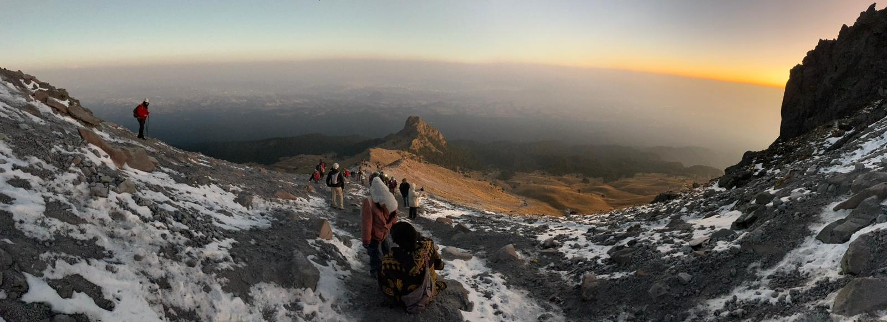
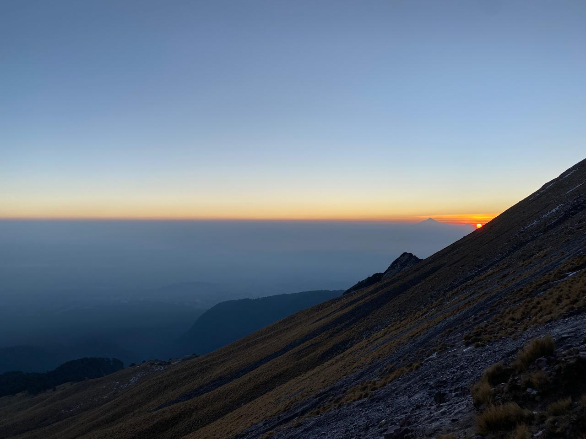

As I type this note, my right forefinger has a sensation I've never felt before. It's mildly numb yet fully functional. M tells me later this evening maybe a nerve is probably still chilling in there. Maybe this is how frostbite feels?

Earlier this morning Adam, Jacob and I head out from the cabin around 0150 towards the Malinche trailhead. M checked with some of the locals in town last evening and they mentioned most guided hikes start around 0200 to get to the peak in time for sunrise. We decided to go without a guide since the trail was straightforward and I was reasonably optimistic I could guide the group myself. 

It's a beautiful 3/4 moon night and the moonlight is just sufficient to light most of our path. With temperature skirting just around freezing, Adam realizes he's forgotten his second jacket. We head back to the cabin,grab it and get back to the trail. Around 20 minutes in, we lose the trail. Only later on our way back will we realise that this trail atleast initially switches in and out of the emergency paved route that winds up close to the summit. Thankfully we notice hikers headlamps flashing on the actual trail and bushwack our way to the correct path.

With my right knee in not a great condition, I'd warned the boys we'd be taking this one slow. The path is relentlessly demanding with a steady 30' gradient. We had to cover about 4500 ft. elevation gain in about 4 hrs if we wanted to catch sunrise at the summit. We take breaks as needed but keep a decent steady pace. About 1.5hrs in, Malinche reveals itself right in between the foliage. 

At about 0545, ~13862ft, it feels as if there's a sudden cold front. We layer up as we get to the alpine zone. The scree is mostly frozen and there's quite some ice patches on the path. Neither Adam nor Jacob had brought their gloves. I smack myself for not checking with them before we left the cabin. The three of us take turns sharing the single pair of gloves I had and truck along - one step in front of another. Slowly but surely the summit comes to our line of sight. There're maybe about 70/80 people already trying to summit ahead of us - their headlamps glimmering in the distance. 

At around 0600 and 14108ft, we hit a narrow bottleneck with a slick ice patch slowing people down. I'm beyond concerned none of them are wearing microspikes or crampons. Well, Adam and Jacob don't have it too. Adam mentioned his shoe didn't have much grip either! I hand him over my microspikes and we head a bit further up. At this point, I'm mentally prepared to turn around and flag this to both of them. My main concern was the cold and us not having the right gear to make our way back. With dawn kicking in, ice melt was imminent and there was no way we'd be able to safely get down. We decide to trot up a bit more and hit another bottleneck around the knife-edge that would give us direct view of the summit. About ~400 ft maybe and the summit was right there. On our turn, Adam and Jacob are able to barely make it up the pivot and I'm constantly slipping - with no microspikes. Decide to call it a day and turn around. The boys aren't super happy with the decision but agree. On the way down we see a taste of what we'd have to endure had we continued on. But for a few minor slips we make it below the alpine range. 

Coincidentally, this weekend, Deepa was hiking Nevado De Toluca and Jordan was doing a multi summit hike to Izta and Pico de Orizaba. We'd hear later that they had conducive conditions and were able to summit the peaks just as planned. 

We make it back to the Malintzi Cabin around 0945. A quick breakfast and we make our way back to CDMX around 1400. The stay at the cabin was great and I'm so glad we decided to stay overnight here. 

With Malinche off my list now, I'm pretty undecided on Orizaba. I'll probably give it a bit more thought after the Matamoros trip.

