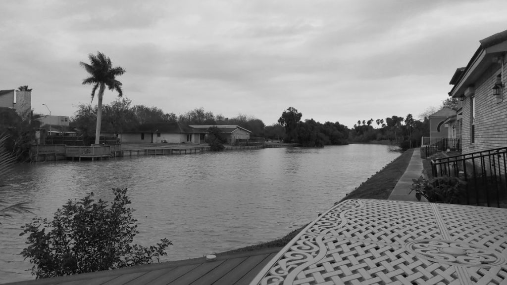

Back from a seemingly long but super-productive trip to Matamoros/Brownsville. This would be my last TDY while here in Mexico City. We went in body-heavy and it did pay-off. A good bunch of cables were pulled and cameras fixed. The weather was impeccable. With gusty winds, super dark and bearing clouds and temperatures barely hitting the 50s - It was perfect outdoor work weather. More so high up on an extended ladder!

Got to meet the Candadai's the day I landed. They own a property right by a beautiful irrigation canal and this place reminded me of the serene back-waters in Kerala. I totally see myself retiring in a place like this!

M's offer got rescinded because of the hiring freeze. Super bummed but I guess the writing was on the wall. Well, at least there's a bit more clarity now and we can plan our home leave together. The new administration is pushing quite a changes. I'm all for productivity and efficiency but I don't quite think they really see or understand the scope of what they're pushing out. With direct impacts, for now it's a wait and act game!

 With the Matamoros TDY done, I can now shift gears at work and throttle up the check-out procedures. 

Someone added *Cliffs of Dover* to the Barnyard Burger's Jukebox. Been years that I've heard this song! 