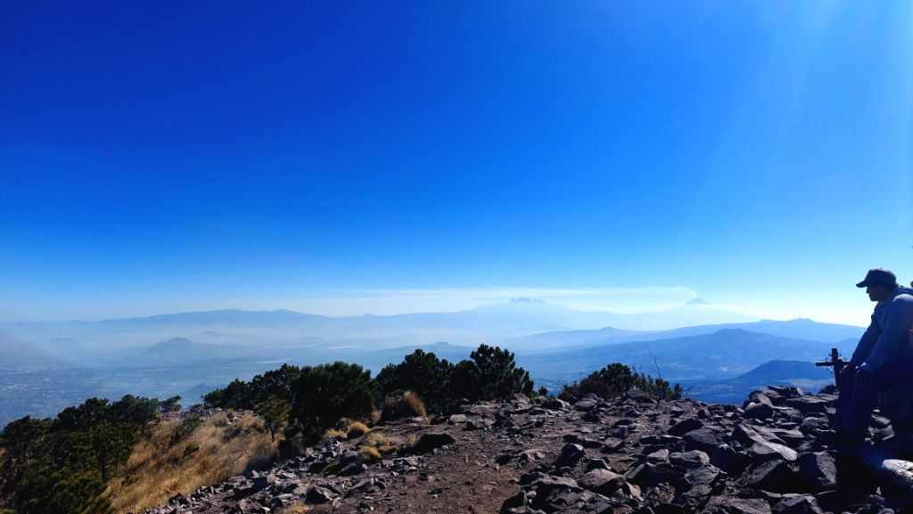

I wanted to get some miles and alts in before we head to Orizaba next weekend. Decided on climbing Pico de Aguila since it's just an hour from home. Hit the road around 0700 towards Ajusco. Since we didn't quite have a working toll pass, Google maps took us through some inner roads. Boy, what a ride it was! Had we not had a local bus meandering ahead of us, I'm pretty sure, I would have chosen a different route. Having *tope's* on a 80 gradient uphill didn't help either. Just thankful we made it safely to the trailhead around 0830.

The moment we got there, I realised this was a different spot from when I'd done this [hike with Mauricio](https://srikanthperinkulam.com/2024/04/14/pico-de-%C3%A1guila/) earlier in 2024. We hit the trail soon and as expected we were huffing just a few minutes in. The trail, though well marked, was also misleading in quite a few spots. So glad I had the offline maps pulled up in AllTrails. At around 1017 we summited the peak @12,496 ft. The sky was super clear and we could get some real neat views of Iztachiuatl and Popocatepetl. Also maybe Malinche in the distance? We decide to turn around and take the same route back. After a bunch of wrong turns, we get back to the trailhead around 1200. Grab a quick bite by the quaint restaurant and make our way back to base by 1430. Great short hike with some rewarding views!  



 